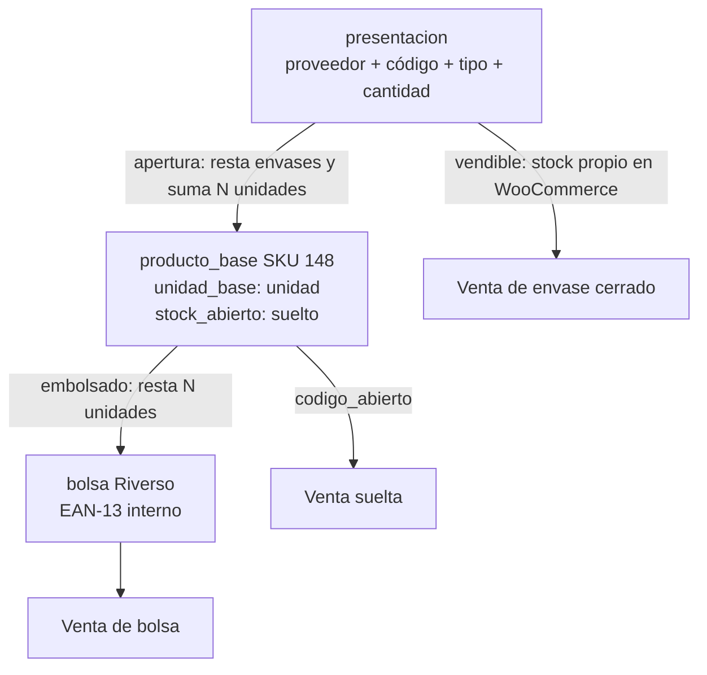
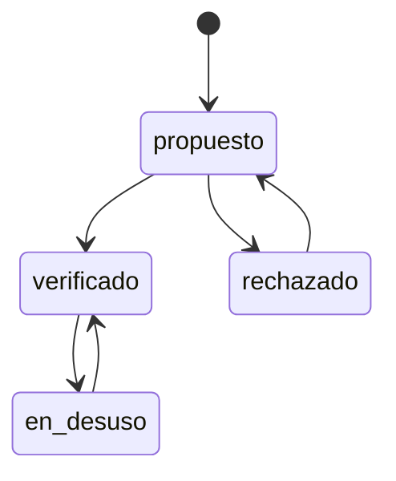
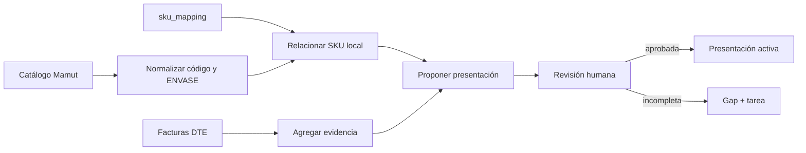

# Rediseño del catálogo legacy y sus presentaciones

## 1. Propósito

Este documento define cómo ordenar los productos, códigos de proveedor, códigos de
barra, envases y bolsas históricas sin interrumpir la operación de Riverso POS.

La decisión de diseño es mantener un modelo híbrido:

- los envases cerrados que se venden como tales mantienen stock propio;
- los envases que solo se compran para abrirse se convierten a unidades base;
- las unidades sueltas y las bolsas preparadas consumen un stock abierto común;
- los SKU legacy no se renombran;
- los EAN-13 impresos anteriormente siguen siendo aceptados.

Este documento es una especificación. No aplica migraciones ni cambia el código
productivo.

## 2. Principios

1. WooCommerce sigue siendo la fuente de verdad de las presentaciones vendibles y
   sus existencias cerradas.
2. `producto_base` representa el artículo físico mínimo intercambiable, no un
   envase ni un proveedor.
3. Una presentación expresa cómo un proveedor entrega o cómo Riverso vende una
   cantidad del producto base.
4. Ningún código histórico se elimina. Se reclasifica, desactiva o marca en desuso
   con trazabilidad.
5. Toda automatización que infiera relaciones queda pendiente de revisión humana.
6. Las migraciones se habilitan gradualmente y deben ser reversibles mediante
   configuración, no mediante borrado de datos.
7. Costos y cantidades no se corrigen silenciosamente: toda corrección conserva
   fuente, fecha, usuario y valor anterior.

## 3. Capacidades que ya existen

El plugin `riverso-pos` v1.4.3 ya contiene la mayor parte de las piezas necesarias.
El rediseño debe consolidarlas, no crear un segundo dominio paralelo.

### 3.1 Producto canónico

La tabla `riverso_producto_base` ya dispone de:

- `canonical_sku`;
- `nombre_canonico`;
- `unidad_base`;
- `stock_abierto`;
- `stock_abierto_habilitado`;
- `codigo_abierto`;
- referencias al producto y variación de WooCommerce.

`codigo_abierto` ya cubre el concepto de código para vender un producto suelto.
No se necesita crear un SKU canónico nuevo solo porque una caja se abra.

### 3.2 Proveedores y conversiones

`riverso_producto_proveedor` relaciona un producto con un proveedor y conserva:

- código y código de barras del proveedor;
- unidad de compra;
- factor de conversión;
- precio de referencia;
- estado y puntuación del matching;
- origen de los datos y revisión humana.

La relación existe, pero la cantidad de una presentación también aparece en
`envases.cantidad_unidades` y `codigo_barra.cantidad`. Esta duplicación debe
resolverse designando una sola fuente de verdad.

### 3.3 Apertura y embolsado

El módulo activo
`php/riverso-pos/modules/packaging/class-packaging-module.php` ya implementa:

- `envases`: definición del envase cerrado;
- `aperturas`: conversión de envases a stock abierto;
- `bolsas`: preparación de una cantidad desde stock abierto;
- descuento del stock cerrado en WooCommerce;
- movimientos de inventario y auditoría;
- creación de tareas para verificar etiquetas.

`open_envase()` descuenta existencias cerradas y suma unidades a
`producto_base.stock_abierto`. `create_bolsa()` consume esas unidades y genera el
registro de bolsa.

### 3.4 EAN-13 interno

`Riverso_EAN13_Generator` implementa el formato histórico:

```text
2 SSSSSS QQQQQ X
| |      |     |
| |      |     +-- dígito verificador EAN-13
| |      +-------- cantidad, cinco dígitos
| +--------------- SKU numérico, seis dígitos
+----------------- prefijo interno
```

Por ejemplo, `2000148003008` representa SKU `148` y cantidad `300`.

### 3.5 Códigos

Actualmente coexisten:

- `riverso_barcodes`;
- `riverso_codigos.codigo_barras`;
- `riverso_codigo_barra`;
- códigos en `riverso_supplier_product_links`;
- códigos en `riverso_producto_proveedor`.

`Riverso_Barcode_Model::resolve()` intenta resolver primero
`riverso_codigo_barra` y luego parte del legado. El modelo unificado ya existe,
pero la consolidación y la compatibilidad algorítmica todavía están incompletas.

### 3.6 Precios

El motor de reglas ya soporta:

- tramos `qty_min` y `qty_max`;
- suma y multiplicación;
- redondeo hacia la decena superior;
- reglas versionadas y aprobables;
- asignación a productos o familias.

Por tanto, la política de tornillos debe configurarse en este motor y no
codificarse dentro del POS o del módulo de productos.

### 3.7 Tareas y revisión humana

Ya existen `riverso_tareas`, `riverso_tarea_historial`,
`riverso_create_review_task()` y los campos `requires_human_review`. El tablero
de completitud debe alimentar esta infraestructura, evitando crear otro gestor
de tareas.

## 4. Brechas que sí deben resolverse

Las brechas principales son:

1. no hay una fuente de verdad única para las presentaciones y sus cantidades;
2. el resolvedor no interpreta todos los EAN-13 legacy si no están registrados;
3. los códigos solo tienen un estado binario `activo`, insuficiente para
   reclasificar malas prácticas históricas;
4. no existe un inventario persistente e idempotente de datos faltantes;
5. el backfill del catálogo del proveedor no está integrado con presentaciones,
   costos y tareas.

Además hay deuda técnica transversal: módulos duplicados, diferencias de esquema
y credenciales de despliegue en scripts.

## 5. Modelo híbrido de presentaciones

### 5.1 Conceptos

#### Producto base

Es la unidad física mínima que Riverso controla y vende. Para el ejemplo:

```text
SKU canónico: 148
Producto: TORNILLO DRYWALL PUNTA BROCA 6 x 1 1/4
Unidad base: unidad
```

Los códigos `02TADB`, `02TADB-S`, `02TADB-J` y `K02TABB` no son productos base
distintos si contienen el mismo tornillo. Son presentaciones distintas.

#### Presentación

Es una cantidad definida del producto base asociada a un origen, normalmente un
proveedor. Puede ser un envase, caja, balde, bolsa de fábrica u otra unidad de
compra o venta.

#### Bolsa Riverso

Es una presentación interna producida desde stock abierto. Su cantidad puede ser
estándar o solicitada al momento de embolsar, y su etiqueta puede usar el EAN-13
interno.

### 5.2 Flujo de stock



### 5.3 Clasificación operativa

Cada presentación debe declarar dos decisiones independientes:

- `es_vendible`: puede aparecer y venderse como una línea propia;
- `lleva_stock_propio`: su cantidad cerrada se controla separadamente.

Reglas:

- una presentación vendible y con stock propio debe tener SKU de presentación,
  referencia WooCommerce y stock cerrado;
- una presentación solo de compra no necesita publicarse en WooCommerce;
- una presentación que siempre se abre puede convertirse a unidades durante la
  recepción, dejando el movimiento y el lote de origen;
- nunca se debe sumar simultáneamente el contenido al stock abierto y conservar
  el mismo envase como disponible, pues duplicaría inventario.

Ejemplos:

| Código | Cantidad | Uso propuesto | Stock |
|---|---:|---|---|
| `02TADB` | 1.000 | Envase de compra, según operación | Cerrado si puede venderse; abierto al recepcionar si no |
| `02TADB-S` | 250 | Envase que normalmente se abre | Conversión directa a abierto |
| `02TADB-J` | 100 | Envase que normalmente se abre | Conversión directa a abierto |
| `K02TABB` | 11.000 | Caja vendible y abrible | Stock propio hasta su venta o apertura |
| EAN `2000148003008` | 300 | Bolsa Riverso | Consume 300 unidades abiertas |

La clasificación inicial debe quedar en revisión humana: el sufijo de un código
no permite inferir con certeza su cantidad ni si se vende cerrado.

### 5.4 Fuente de verdad

Se recomienda evolucionar `riverso_envases` hacia
`riverso_presentaciones`. Puede hacerse renombrando la tabla en una migración
controlada o, con menor riesgo, agregando los campos y conservando temporalmente
el nombre físico `envases`.

Campos mínimos:

| Campo | Propósito |
|---|---|
| `id` | Identidad estable de la presentación |
| `producto_base_id` | Producto contenido |
| `producto_proveedor_id` | Relación exacta con proveedor, opcional para internas |
| `proveedor_id` | Denormalización opcional para consulta |
| `codigo_proveedor` | Código comercial del proveedor |
| `tipo_envase` | `envase`, `caja`, `balde`, `bolsa_fabrica`, `bolsa_interna`, `otro` |
| `cantidad_unidades` | Factor exacto a la unidad base |
| `unidad_base` | Copia controlada o referencia a la unidad del producto |
| `sku_presentacion` | SKU propio solo si corresponde |
| `woocommerce_product_id` | Producto publicado, si corresponde |
| `woocommerce_variation_id` | Variación publicada, si corresponde |
| `es_vendible` | Puede venderse cerrada |
| `lleva_stock_propio` | Controla existencia cerrada |
| `permite_apertura` | Puede convertirse a stock abierto |
| `origen_datos` | Catálogo, factura, importación o decisión humana |
| `requires_human_review` | Inferencia pendiente |
| `review_status` | Estado de revisión |
| `activo` | Disponibilidad operativa |
| `created_at`, `updated_at` | Trazabilidad |

La fuente de verdad para la cantidad será
`presentaciones.cantidad_unidades`. Los demás campos pasan a tener estas
funciones:

- `producto_proveedor.factor_conversion`: caché compatible o valor derivado de
  la presentación preferida, no fuente primaria;
- `codigo_barra.cantidad`: dato resuelto y validable contra la presentación;
- `codigo_barra.envase_id`: referencia a la presentación;
- `envases.cantidad_unidades`: fuente primaria durante la transición.

Las discrepancias entre estos campos deben crear un gap, no corregirse por
precedencia silenciosa.

### 5.5 Política de SKU

El SKU base legacy se conserva:

```text
148 = producto base
148-E250 = presentación de envase de 250
148-E1000 = presentación de envase de 1.000
148-K11000 = presentación de caja de 11.000
```

Los sufijos son una convención interna legible, no una forma de calcular la
cantidad. La cantidad siempre se consulta desde la presentación.

No se debe crear un producto base nuevo por cada proveedor o envase. Solo se crea
otro producto base cuando el artículo físico no es intercambiable: cambia medida,
material, acabado, resistencia u otra propiedad que afecte la venta o el uso.

Conservar `148` permite resolver etiquetas legacy sin reimprimirlas ni mantener
una tabla de renombre masiva.

### 5.6 Apertura, lote y costo

Toda apertura debe ser atómica:

1. bloquear o validar el stock cerrado disponible;
2. descontar la cantidad de envases;
3. calcular `unidades_abiertas = envases * cantidad_unidades`;
4. sumar esas unidades a `stock_abierto`;
5. conservar lote y costo de origen;
6. registrar movimiento y auditoría;
7. confirmar todos los pasos o revertirlos.

El proceso actual realiza varias escrituras consecutivas. La implementación
futura debe envolverlas en transacción de base de datos y evitar
`GREATEST(0, ...)`, porque convertir un faltante en cero oculta un error de
inventario.

Para múltiples lotes abiertos, el costo del stock abierto debe definirse
explícitamente (promedio ponderado o capas FIFO). No se debe recalcular solo desde
el último precio de referencia.

## 6. Resolvedor único de códigos

### 6.1 Contrato

Todo canal (POS, recepción, inventario, etiquetas y administración) debe llamar a
un mismo servicio. La respuesta mínima será:

```php
[
    'codigo'             => '2000148003008',
    'producto_base_id'   => 123,
    'cantidad_unidades'  => 300.0,
    'presentacion_id'    => null,
    'proveedor_id'       => null,
    'tipo'               => 'bolsa_legacy',
    'origen'             => 'ean13_algoritmico',
    'confianza'          => 1.0,
    'requires_review'    => false,
]
```

Los consumidores no deben interpretar por su cuenta SKU, cantidad o código de
proveedor.

### 6.2 Orden de resolución

1. normalizar espacios y caracteres admitidos sin retirar ceros significativos;
2. consultar `riverso_codigo_barra` activo y verificado;
3. si es un EAN-13 interno válido, intentar la interpretación algorítmica legacy;
4. consultar fuentes legacy durante la ventana de compatibilidad;
5. consultar código de proveedor dentro del proveedor conocido en una recepción;
6. devolver `no_resuelto` y registrar un gap; nunca elegir arbitrariamente entre
   coincidencias.

Un código duplicado entre proveedores puede ser válido. Por eso la clave lógica
para códigos de proveedor es `(proveedor_id, codigo)`, mientras que un EAN
comercial debe ser globalmente único cuando así lo determine su tipo.

### 6.3 Fallback de bolsas legacy

Si el código no tiene registro persistido:

```php
if (Riverso_EAN13_Generator::is_internal($code)) {
    $parsed = Riverso_EAN13_Generator::parse($code);
    $normalized_sku = ltrim($parsed['sku'], '0');
    $normalized_sku = $normalized_sku === '' ? '0' : $normalized_sku;

    // Buscar una coincidencia exacta y única en canonical_sku.
    // Si existe, devolver producto + cantidad con origen ean13_algoritmico.
}
```

La consulta debe comparar una forma normalizada controlada, no convertir todos
los SKU a entero en SQL. Los SKU pueden contener letras o ceros significativos.
Si no hay una coincidencia única se crea `bolsa_legacy_no_resoluble`.

### 6.4 Riesgos del formato actual

En el export legacy analizado hay 4.691 SKU, 15 no numéricos y códigos de hasta
ocho dígitos, por ejemplo `20984100`, `2098425` y `2098450`.

El generador actual:

```php
$sku_digits = substr($sku_digits, -6);
```

provoca dos problemas:

- diferentes SKU largos pueden compartir los últimos seis dígitos;
- los SKU alfanuméricos pierden sus letras y pueden colisionar.

La generación debe fallar de forma explícita ante un SKU no representable. Nunca
debe truncar silenciosamente.

### 6.5 Evolución del EAN interno

Los códigos impresos conservan su interpretación:

```text
2 0 KKKKK QQQQQ X
```

Para SKU numéricos menores a 100.000, el primer dígito de los seis reservados al
SKU histórico es `0`. Puede reinterpretarse como versión/tipo `0` sin cambiar el
código existente:

- `0`: legacy, SKU numérico de cinco dígitos + cantidad;
- `1`: identificador interno asignado + cantidad;
- `2` a `9`: reservados.

Formato lógico:

```text
2 T IIIII QQQQQ X
```

`IIIII` no debe intentar contener un SKU de ocho dígitos. Para SKU largos o
alfanuméricos será un identificador estable asignado en una tabla de alias, con
restricción única. Esa tabla relacionará `T + IIIII` con `producto_base_id`.

Antes de habilitar `T=1` se requiere:

1. inventario de todos los EAN internos existentes;
2. prueba de colisiones;
3. reserva de identificadores;
4. actualización conjunta de generación, resolución e impresión;
5. pruebas con lectores y POS.

Hasta completar esa migración, solo se generan códigos para SKU numéricos de
hasta seis dígitos cuya representación sea única. Los demás usan un EAN interno
persistido o un código interno alternativo.

### 6.6 Regla para generar etiquetas

El EAN se construye desde la identidad canónica o desde el alias asignado, nunca
desde `sku_presentacion`.

`build('148-E1000', 300)` extraería los dígitos `1481000`, los truncaría a
`481000` y generaría una identidad incorrecta. El sufijo de presentación es
descriptivo y no debe entrar al algoritmo.

### 6.7 Transición de las tablas legacy

Durante la migración:

- escritura nueva solo en `riverso_codigo_barra`;
- lectura dual con métricas de qué fallback fue utilizado;
- backfill de registros usados recientemente;
- corrección de la consulta legacy, pues el esquema observado usa
  `barcodes.barcode` mientras una ruta del modelo consulta `barcodes.ean13`;
- retiro del dual-read solo cuando no existan resoluciones legacy durante un
  periodo acordado.

## 7. Ciclo de vida de los códigos

### 7.1 Estados

`activo` debe mantenerse temporalmente por compatibilidad, pero el estado de
negocio será:



- `propuesto`: importado o inferido, aún no operativo sin revisión;
- `verificado`: aprobado por una persona y resoluble;
- `rechazado`: relación incorrecta que nunca debió usarse;
- `en_desuso`: relación antes válida o tolerada que ya no debe usarse.

Un código en desuso puede seguir reconociéndose para advertir y orientar al
operador, pero no debe utilizarse para crear nuevas etiquetas.

### 7.2 Trazabilidad

Cada cambio registra en `codigos_historial`:

- código y entidad relacionada;
- estado anterior y nuevo;
- tipo anterior y nuevo;
- motivo;
- usuario o actor del sistema;
- fecha;
- fuente de la decisión.

No se borran códigos con historial comercial o etiquetas físicas.

### 7.3 Código de proveedor usado como barcode

`02TADB` puede haberse guardado como barcode por comodidad. Es un identificador
de proveedor, no un EAN comercial.

Tratamiento:

1. detectar que no cumple un formato EAN/UPC válido;
2. buscar el mismo valor en la relación del proveedor;
3. proponer `tipo='supplier'`;
4. conservar la capacidad de escanearlo cuando no sea ambiguo;
5. marcar el registro barcode anterior `en_desuso` con motivo
   `reclasificado_como_codigo_proveedor`;
6. crear una tarea si hay múltiples productos o proveedores candidatos.

No debe marcarse automáticamente en desuso cuando todavía es la única etiqueta
física utilizada en bodega.

## 8. Salud del catálogo y contador de pendientes

### 8.1 Separar gaps de tareas

Un gap es un hecho de calidad de datos; una tarea es trabajo humano. No todo gap
merece una tarea individual.

Ejemplo: 800 productos sin ubicación deben aparecer como 800 gaps filtrables,
pero pueden originar una tarea agrupada por bodega o categoría.

### 8.2 Tabla propuesta

```sql
CREATE TABLE {prefix}riverso_data_gaps (
    id BIGINT UNSIGNED NOT NULL AUTO_INCREMENT,
    regla VARCHAR(100) NOT NULL,
    entidad_tipo VARCHAR(50) NOT NULL,
    entidad_id BIGINT UNSIGNED NOT NULL,
    fingerprint CHAR(64) NOT NULL,
    severidad VARCHAR(20) NOT NULL DEFAULT 'media',
    estado VARCHAR(20) NOT NULL DEFAULT 'abierto',
    detalle_json LONGTEXT NULL,
    origen VARCHAR(50) NOT NULL DEFAULT 'scanner',
    detectado_at DATETIME NOT NULL,
    visto_ultima_vez_at DATETIME NOT NULL,
    resuelto_at DATETIME NULL,
    ignorado_hasta DATETIME NULL,
    tarea_id BIGINT UNSIGNED NULL,
    notas TEXT NULL,
    PRIMARY KEY (id),
    UNIQUE KEY ux_gap_activo (regla, entidad_tipo, entidad_id, fingerprint),
    KEY idx_estado_severidad (estado, severidad),
    KEY idx_tarea (tarea_id)
);
```

`fingerprint` incluye los valores relevantes para distinguir una nueva
incidencia de una ya resuelta. `detalle_json` conserva evidencia y valores
observados.

### 8.3 Comportamiento del scanner

`Riverso_Gap_Scanner` mantiene un registro de reglas. Cada regla devuelve:

- entidad afectada;
- severidad;
- fingerprint;
- evidencia;
- acción sugerida.

En cada ejecución:

1. obtiene un lock para impedir corridas simultáneas;
2. evalúa reglas por lotes;
3. inserta gaps nuevos;
4. actualiza `visto_ultima_vez_at` en gaps persistentes;
5. reabre un gap si reaparece con la misma evidencia;
6. resuelve los gaps que ya no aparecen;
7. agrupa y crea tareas según política;
8. publica métricas de duración, errores y cantidades.

La operación debe ser idempotente. Ejecutar el scanner dos veces con los mismos
datos no crea duplicados ni tareas adicionales.

WP-Cron puede programar el proceso, pero para producción se recomienda invocar
el evento de WP-Cron desde cron del servidor, evitando depender de visitas al
sitio.

### 8.4 Reglas iniciales

| Regla | Condición | Severidad sugerida | Acción |
|---|---|---|---|
| `producto_sin_presentacion` | Producto activo sin presentación | Media | Revisar si se vende solo suelto |
| `presentacion_sin_cantidad` | Cantidad nula, cero o `1` sospechoso | Alta | Completar desde catálogo/factura |
| `codigo_proveedor_sin_cantidad` | Factor `1` y patrón de envase | Alta | Verificar presentación |
| `codigo_barra_sin_proveedor` | Código declarado de proveedor sin proveedor | Alta | Asociar o reclasificar |
| `codigo_barra_sin_cantidad` | Código resoluble sin factor confiable | Alta | Completar cantidad |
| `codigo_proveedor_como_barcode` | Código alfanumérico guardado como EAN | Media | Reclasificar |
| `producto_sin_barcode` | Producto sin ningún código verificable | Baja | Etiquetar si operación lo requiere |
| `barcode_duplicado` | EAN global apunta a más de un producto | Crítica | Bloquear resolución |
| `ean13_invalido` | Largo o dígito verificador incorrecto | Alta | Corregir o marcar en desuso |
| `bolsa_legacy_no_resoluble` | EAN interno válido sin SKU único | Crítica | Crear alias o corregir producto |
| `producto_sin_ubicacion` | Producto activo sin ubicación principal | Media | Asignar bodega |
| `producto_sin_precio_aprobado` | Producto vendible sin precio vigente | Crítica | Bloquear publicación/venta |
| `producto_sin_familia` | Producto sin familia cuando la categoría la exige | Baja | Clasificar |
| `cantidad_inconsistente` | Presentación, barcode y proveedor discrepan | Crítica | Revisar fuente de verdad |
| `sku_ean_no_representable` | SKU largo o alfanumérico sin alias EAN | Alta | Asignar alias |

La cantidad `1` no es siempre un error. Solo debe considerarse sospechosa si el
tipo es caja/envase/balde, si el nombre sugiere contenido múltiple o si existe un
código alternativo del mismo producto con otra cantidad.

### 8.5 Política de tareas

- severidad crítica: tarea inmediata y bloqueo del flujo afectado;
- alta: tarea agrupada por proveedor o módulo;
- media: aparece en la bandeja de calidad; tarea al superar antigüedad;
- baja: contador y lista, sin tarea automática.

Cada tarea guarda filtros o IDs de gaps relacionados en `datos_extra`. Al
completarla, el scanner verifica la condición: completar una tarea no puede
cerrar un gap que todavía existe.

### 8.6 Pantalla “Salud del catálogo”

La pantalla debe mostrar:

- total de gaps abiertos por severidad;
- porcentaje de cobertura por dimensión;
- tendencias de abiertos y resueltos;
- antigüedad del gap más antiguo;
- filtros por regla, proveedor, categoría, producto y responsable;
- acciones masivas seguras;
- exportación para revisión;
- enlace a producto, código, presentación o tarea.

La cobertura debe mostrarse por dimensiones, no como un único número que oculte
problemas:

```text
Presentaciones completas = presentaciones válidas / presentaciones activas
Códigos verificados       = códigos verificados / códigos activos
Productos ubicados        = productos con ubicación / productos inventariables
Precios aprobados         = productos con precio / productos vendibles
```

Puede existir un indicador general ponderado, pero siempre acompañado de sus
componentes y denominadores.

El dashboard actual puede añadir tarjetas con gaps críticos, gaps totales y
cobertura. Las consultas y cálculos deben vivir en un servicio, no directamente
en `templates/dashboard.php`.

## 9. Backfill desde el catálogo del proveedor

### 9.1 Fuentes

- `data/catalogo_mamut_2025_spatial.json`: 5.145 códigos y atributos, incluido
  `ENVASE`;
- `data/sku_mapping.json`: 1.065 relaciones de código Mamut a SKU local;
- facturas DTE: código, cantidad comprada, unidad y precio;
- export legacy de productos y códigos de barra.

Ejemplos disponibles:

```text
02TADB   -> 1.000 U
02TADB-S -> 250 U
02TADB-J -> 100 U
```

`K02TABB` no aparece en el catálogo parseado y su cantidad de 11.000 no puede
considerarse verificada solo por estar escrita en el prompt.

### 9.2 Pipeline



Pasos:

1. validar versión, checksum y fecha de cada fuente;
2. normalizar códigos sin eliminar guiones significativos;
3. parsear `ENVASE` a cantidad y unidad conservando el texto original;
4. resolver el código mediante `sku_mapping`;
5. localizar de forma única `producto_base.canonical_sku`;
6. crear o actualizar una propuesta de presentación;
7. registrar `origen_datos='catalogo_mamut'`;
8. marcar `requires_human_review=1`;
9. comparar con facturas, barcodes y conversiones existentes;
10. crear gaps ante ausencia o contradicción;
11. activar solo después de revisión.

El proceso debe soportar modo `dry-run`, reanudación, informe de cambios y
reversión de propuestas no aprobadas.

### 9.3 Confianza

Confianza alta requiere:

- mapeo código→SKU explícito;
- producto base único;
- cantidad y unidad parseables;
- ausencia de contradicciones.

Una coincidencia por nombre o sufijo nunca se activa automáticamente. Sufijos
como `-S` y `-J` no tienen una cantidad universal.

### 9.4 Caso `K02TABB`

Al no estar en el catálogo parseado:

1. se conserva como código observado;
2. se relaciona con el proveedor si hay evidencia;
3. se crea una presentación propuesta sin cantidad verificada;
4. se registra `presentacion_sin_cantidad`;
5. se adjuntan facturas o fotografías como evidencia;
6. una persona confirma 11.000 antes de usar el factor en costos o stock.

### 9.5 Impacto en costos

Si una factura cobra un envase y se interpreta como una unidad, el costo unitario
queda multiplicado por su contenido.

La fórmula correcta es:

```text
costo unitario base =
  (costo neto línea + flete prorrateado + costos atribuibles)
  / (cantidad de envases * unidades por envase)
```

La recepción debe bloquear el cálculo definitivo cuando la cantidad de la
presentación no esté verificada. Puede registrar un costo provisional con estado
pendiente, pero no debe contaminar:

- `lotes.costo_unitario`;
- `cost_history.unit_cost`;
- costo de stock abierto;
- precio de referencia;
- margen y reglas de precio.

Al aprobar una cantidad corregida, el sistema debe recalcular los documentos y
lotes afectados mediante un proceso auditable, no modificar solo el último
valor.

## 10. Precios

### 10.1 Regla descrita

Para el producto del ejemplo, el requerimiento indica:

| Cantidad | Precio unitario |
|---:|---|
| 1 a 30 | precio de referencia + 3, luego techo a la decena |
| 31 a 300 | precio de referencia + 3 |
| 301 o más | precio de referencia |

Debe configurarse como una versión nueva de `price_rules`, con tres tramos, y
asignarse a la familia de tornillos correspondiente. La versión requiere prueba
y aprobación antes de activarse.

### 10.2 Ambigüedad a resolver

El texto “sumar 3 pesos” debe confirmarse con ejemplos reales. Si el precio de
referencia unitario es bajo, sumar `$3` es razonable; si se quería indicar un
factor o porcentaje, el resultado cambia sustancialmente.

También debe definirse si “aproximar a la decena más alta” se aplica al precio
unitario o al total de la línea. El motor actual calcula precio unitario.

### 10.3 Diferencia con `R-1`

La regla semilla `R-1` del código usa seis tramos:

- 1–20: multiplicador 3;
- 21–50: multiplicador 2;
- 51–100: suma 4;
- 101–299: suma 3;
- 300–10.999: multiplicador 1;
- 11.000+: multiplicador 1,7.

No representa la regla descrita en el prompt. No debe modificarse en producción
sin identificar qué productos la usan. Procedimiento:

1. listar asignaciones actuales de `R-1`;
2. obtener ejemplos de venta y resultados esperados;
3. crear una regla nueva en borrador;
4. ejecutar pruebas de frontera: 1, 30, 31, 300 y 301;
5. comparar márgenes;
6. aprobar y reasignar únicamente la familia acordada;
7. conservar la versión anterior para auditoría.

## 11. Deuda técnica y riesgos

### 11.1 Módulos duplicados

Hay implementaciones paralelas en `modules/` y `catalog/`, entre ellas:

- packaging;
- barcodes;
- `class-ean13-generator.php`.

El módulo activo de packaging carga
`modules/barcodes/class-ean13-generator.php`. Modificar solo la copia de
`catalog/` no cambia el comportamiento productivo.

Antes de implementar este diseño debe existir un mapa de carga y una única clase
canónica por responsabilidad. La eliminación física de duplicados se hará en un
cambio separado, tras confirmar que ningún bootstrap o script externo los usa.

### 11.2 Drift de esquema

Se observaron diferencias como:

- `barcodes.barcode` frente a consultas de `barcodes.ean13`;
- `conteos` frente a `conteo_sesiones`;
- `orden_compra_items` frente a `ordenes_compra_items`.

La migración debe incluir una inspección real del esquema productivo y pruebas de
upgrade desde cada versión soportada.

### 11.3 Transacciones y concurrencia

Apertura, embolsado, recepción y venta modifican inventario. Deben usar:

- transacciones;
- bloqueo de filas o actualizaciones condicionales;
- claves idempotentes;
- rechazo de stock negativo;
- auditoría con correlación.

Sin ello, dos operadores pueden abrir o embolsar la misma existencia.

### 11.4 Credenciales

Scripts como `apply_local_store_integration.py`,
`apply_products_migrations.py` y verificadores remotos no deben contener
credenciales en claro.

Acciones previas a otro despliegue:

1. rotar las credenciales expuestas;
2. cargarlas desde variables de entorno o un almacén seguro;
3. evitar imprimir secretos en logs;
4. excluir archivos locales de secretos;
5. revisar el historial de Git y los artefactos ZIP.

## 12. Plan de migración sin interrupción

### Fase 0 — Línea base y seguridad

Objetivo: conocer el estado real y poder volver atrás.

- respaldo verificado de base de datos y plugin;
- inventario de versiones y esquema productivo;
- rotación de credenciales;
- métricas de productos, códigos, envases, bolsas y fallbacks;
- pruebas automatizadas para EAN legacy y movimientos de stock.

Criterio de salida: respaldo restaurable y checklist reproducible.

### Fase 1 — Consolidación técnica

Objetivo: definir rutas canónicas antes de añadir comportamiento.

- mapear bootstrap y clases activas;
- seleccionar implementación canónica de packaging/barcodes/EAN;
- corregir drift de columnas en lectura legacy;
- introducir contratos de servicios sin cambiar resultados;
- probar POS, recepción, apertura, embolsado e impresión.

Criterio de salida: una única ruta de ejecución observada por capacidad.

### Fase 2 — Presentaciones en sombra

Objetivo: poblar el modelo sin afectar stock ni ventas.

- ampliar `envases` o crear `presentaciones`;
- importar catálogo y `sku_mapping` en modo propuesta;
- conservar origen, evidencia y revisión;
- detectar discrepancias;
- no publicar ni convertir stock automáticamente.

Criterio de salida: cobertura medida y muestra aprobada por operación.

### Fase 3 — Resolvedor compatible

Objetivo: aceptar códigos nuevos y antiguos desde un solo servicio.

- implementar contrato unificado;
- añadir fallback algorítmico EAN legacy;
- registrar origen de cada resolución;
- bloquear ambigüedades;
- probar `2000148003008` y una muestra de etiquetas físicas;
- impedir truncamiento al generar nuevos códigos.

Criterio de salida: todas las etiquetas de la muestra resuelven al producto y
cantidad esperados, sin colisiones.

### Fase 4 — Salud del catálogo

Objetivo: convertir faltantes en una cola administrable.

- crear `data_gaps`;
- ejecutar scanner en dry-run;
- validar reglas y falsos positivos;
- habilitar contadores;
- crear tareas agrupadas solo según severidad;
- configurar cron y alertas de fallo.

Criterio de salida: dos ejecuciones idénticas no crean duplicados y cada contador
es trazable a sus registros.

### Fase 5 — Stock híbrido controlado

Objetivo: activar el modelo con alcance pequeño.

- elegir una familia piloto;
- clasificar presentaciones vendibles y solo-compra;
- conciliar stock físico inicial;
- activar apertura transaccional;
- activar conversión directa en recepción cuando corresponda;
- comparar WooCommerce, stock abierto, lotes y conteo físico.

Criterio de salida: balance de unidades:

```text
unidades equivalentes iniciales
+ recepciones
- ventas
- mermas
= envases cerrados * factor + stock abierto + bolsas disponibles
```

### Fase 6 — Costos y precios

Objetivo: usar factores verificados en decisiones económicas.

- recalcular costos de la familia piloto;
- revisar documentos históricos afectados;
- crear y aprobar la regla de tres tramos;
- probar cantidades de frontera;
- medir margen antes y después;
- ampliar gradualmente a otras familias.

Criterio de salida: ningún costo definitivo depende de una cantidad pendiente.

### Fase 7 — Depuración legacy

Objetivo: retirar compatibilidad solo cuando deje de utilizarse.

- reclasificar códigos de proveedor usados como barcode;
- marcar códigos obsoletos sin borrarlos;
- medir uso de dual-read;
- migrar códigos consultados;
- archivar tablas legacy después del periodo de observación;
- conservar vistas o informes históricos necesarios.

Criterio de salida: cero resoluciones legacy inesperadas durante el periodo
acordado y procedimiento documentado para etiquetas antiguas.

## 13. Pruebas de aceptación

### Compatibilidad

- escanear `2000148003008` devuelve SKU `148`, cantidad `300`;
- una bolsa legacy no registrada en tablas se resuelve algorítmicamente;
- un SKU largo o alfanumérico no genera un EAN por truncamiento;
- un código en desuso informa su estado y no se usa para nuevas etiquetas.

### Presentaciones e inventario

- abrir una caja de 11.000 resta exactamente una caja y suma 11.000 unidades;
- un fallo en cualquier escritura revierte toda la apertura;
- embolsar 300 resta exactamente 300 unidades;
- no se permite abrir más stock cerrado que el disponible;
- el balance de unidades se mantiene después de recepción, apertura, bolsa y
  venta.

### Calidad de datos

- dos corridas del scanner no duplican gaps ni tareas;
- al corregir la cantidad, el gap se resuelve en la siguiente corrida;
- completar una tarea sin corregir los datos no cierra el gap;
- `K02TABB` permanece pendiente hasta contar con evidencia aprobada.

### Costos y precios

- el costo de una factura se divide por envases y unidades verificadas;
- una cantidad no verificada impide consolidar costo definitivo;
- las cantidades 1, 30, 31, 300 y 301 seleccionan el tramo correcto;
- la regla nueva no altera productos asignados a `R-1`.

## 14. Decisiones pendientes antes de codificar

1. Confirmar con ejemplos si “sumar 3” significa `$3`, 3 %, o un factor.
2. Confirmar si el redondeo se aplica al precio unitario o al total.
3. Decidir FIFO o promedio ponderado para stock abierto de varios lotes.
4. Definir qué presentaciones se venden cerradas y cuáles se abren al recibir.
5. Verificar con evidencia la cantidad de `K02TABB`.
6. Elegir si `envases` se amplía o se migra a una tabla
   `presentaciones`.
7. Definir el periodo mínimo de compatibilidad dual con tablas legacy.
8. Aprobar el esquema de alias para EAN de SKU largos o alfanuméricos.

## 15. Recomendación final

No se recomienda crear un producto base por cada código del proveedor. La
estructura correcta es un producto base estable, múltiples presentaciones con
cantidad y proveedor, y códigos que resuelven hacia esa estructura.

El primer cambio funcional debe ser el resolvedor compatible con bolsas legacy;
el segundo, las presentaciones en sombra; el tercero, el tablero de gaps. El
stock híbrido, los costos recalculados y las nuevas reglas de precio solo deben
activarse después de revisar cantidades y conciliar inventario físico.
