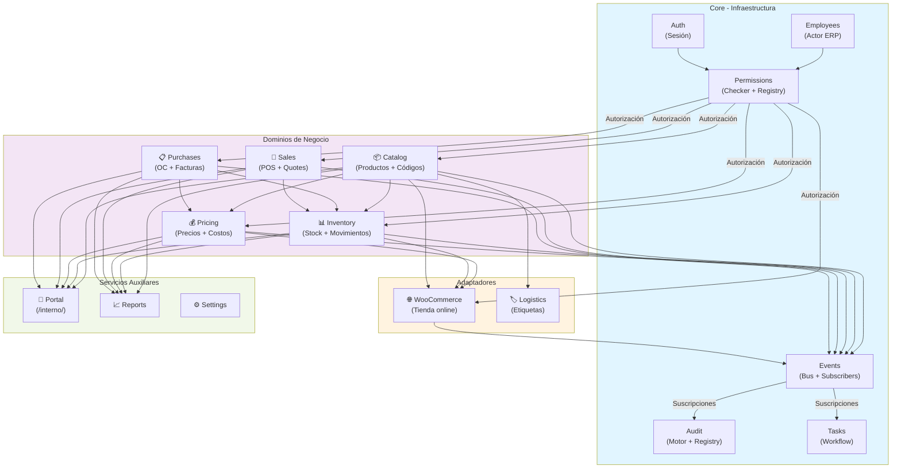

# Arquitectura ERP Riverso: Documento Técnico Completo

**Versión:** 1.0  
**Fecha:** Julio 2026  
**Estado:** Plan de implementación aprobado  
**Ámbito:** Reorganización modular del plugin Riverso POS hacia ERP por dominios

---

## Tabla de contenidos

1. [Diagnóstico actual](#diagnóstico-actual)
2. [Visión y principios](#visión-y-principios)
3. [Arquitectura objetivo](#arquitectura-objetivo)
4. [Movimientos, divisiones y fusiones](#movimientos-divisiones-y-fusiones)
5. [Análisis detallado de módulos](#análisis-detallado-de-módulos)
6. [Fuentes de verdad y sync](#fuentes-de-verdad-y-sync)
7. [Modelo de datos: rediseño de códigos](#modelo-de-datos-rediseño-de-códigos)
8. [Sistemas base: plan de mejora](#sistemas-base-plan-de-mejora)
9. [Roadmap de implementación](#roadmap-de-implementación)
10. [Restricciones y exclusiones](#restricciones-y-exclusiones)

---

## Diagnóstico actual

### Estado del plugin Riverso POS

El plugin vive en `php/riverso-pos/` como un **monolito WordPress modular** con:

- **21 módulos planos** bajo `modules/` (products, invoices, pos, pricing, warehouse, etc.)
- **Servicios transversales mezclados** en `includes/` (audit, permissions, tasks, employees)
- **WooCommerce como runtime** de tienda online; Riverso como fuente de verdad operativa parcial
- **9 fases de migraciones SQL** (phase1–phase9) que modelan dominio incremental desde julio 2025

### Línea de tiempo

- **Antes de 2025:** Tienda WooCommerce + módulos ad-hoc (códigos, facturas, POS básico)
- **Fase 1 (2025-07):** Modelo canónico `producto_base` → `producto_proveedor` → lotes → costos → precios
- **Fase 2–8:** Governance (matching, publication stages), pricing, packaging, invoice intake, auditoría
- **Hoy (2026-07):** Operativo pero sin: sync bidireccional, kardex formal, workflow, OC, reservas, API REST

### Qué hace cada módulo hoy

| Módulo | Ruta | Responsabilidad | Problemas |
|--------|------|-----------------|-----------|
| `products` | `modules/products/` | Lifecycle de `producto_base` | Mezcla catálogo + gobernanza (review, publication_stage) |
| `matching` | `modules/matching/` | Soft-match proveedor↔base | Debería vivir bajo catálogo, no root |
| `codes` | `modules/codes/` | Links proveedor (legacy `riverso_codigos`) | Modelo incompleto (sin cantidad/unidad/envase) |
| `barcodes` | `modules/barcodes/` | EAN13 propios (`riverso_barcodes`) | Duplica concepto de códigos |
| `packaging` | `modules/packaging/` | Envases, aperturas, bolsas | Aislado del modelo de códigos |
| `warehouse` | `modules/warehouse/` | Ubicaciones + movimientos | Sin kardex, sin reservas, sin conteo formal |
| `invoices` | `modules/invoices/` | Facturas DTE XML (recepción) | Parte de compras, mejor aquí |
| `quotes` | `modules/quotes/` | Cotizaciones de proveedor | Debería estar bajo compras |
| `costs` | `modules/costs/` | Historial de costos | Histórico paralelo; mejor bajo pricing |
| `pricing` | `modules/pricing/` | Precios dual (local/online) + reglas | Incluye sync Woo; separar |
| `pos` | `modules/pos/` | Punto de venta | Debería agruparse como subdominio de sales |
| `customer-quotes` | `modules/customer-quotes/` | Cotizaciones a clientes | Parte de sales |
| `publish` | `modules/publish/` | Publicación a WooCommerce | Adaptador WC, no catalogo |
| `import` | `modules/import/` | Import MAMUT + contratos | Adaptador de entrada |
| `tienda-local` | `modules/tienda-local/` | CSV local (legacy paralelo) | Silo independiente; fusionar con import |
| `labels` | `modules/labels/` | Impresión de etiquetas | Logistics/etiquetado |
| `suppliers` | `modules/suppliers/` | Gestión de proveedores | Catálogo/suppliers |
| `portal` | `modules/portal/` | UI portal /interno/ | Presentación, OK aquí |
| `reports` | `modules/reports/` | Reportes AJAX | OK aquí |
| `tasks` | `modules/tasks/` | Tareas operativas | **Core transversal, debe ir a `core/`** |
| `employees` | `modules/employees/` | Perfiles HR | **Core transversal, debe ir a `core/`** |

**Core (no está en módulos, vive en includes):**

| Componente | Ruta | Responsabilidad | Problemas |
|------------|------|-----------------|-----------|
| `audit` | `includes/class-audit.php` + `class-audit-module.php` | Logging central | Sin `employee_id`/`module`, doble API, cobertura incompleta |
| `permissions` | `includes/class-permissions.php` | Roles + capabilities | No extensible, sin contexto (ubicación, equipo) |
| (no existe) | — | **Bus de eventos** | **Crítico para desacoplar módulos** |
| (no existe) | — | **API REST interna** | Necesaria para Python/agente impresión |

---

## Visión y principios

### Objetivo

Transformar Riverso de un **plugin WooCommerce extendido** a un **ERP modular por dominios** donde:

1. **WooCommerce es un adaptador**, no el núcleo.
2. **Auditoría, tareas, permisos, empleados** son infraestructura reutilizable.
3. **Cada dominio** (catálogo, inventario, precios, ventas, compras) es independiente pero integrado.
4. **La migración es gradual** (aliases + classmap, no big-bang).
5. **El sistema sigue siendo WordPress** (no migrar a arquitectura ajena).

### Principios de diseño

| Principio | Aplicación |
|-----------|-----------|
| **Responsabilidad única** | Cada módulo = un agregado de dominio (products, stock, precios) |
| **Dependencias explícitas** | Sin acoplamiento; vía eventos o servicios inyectados |
| **Fuente de verdad única** | Para cada entidad (Riverso es master de catálogo, WC es master de clientes web) |
| **Auditoría omnipresente** | Todo cambio material se registra |
| **Escalabilidad sin crecimiento** | Arquitectura soporta crecer en módulos sin ser inmanejable |
| **Compatibilidad backward** | Migraciones sucesivas; sin breaking changes en AJAX/API hasta no haber reestructurado |

---

## Arquitectura objetivo

### Estructura de directorios física

```text
php/riverso-pos/
├── core/                              # Infraestructura ERP (obligatoria)
│   ├── auth/
│   │   └── class-auth-service.php     # Sesión, login/logout audit
│   ├── employees/
│   │   ├── class-employee.php
│   │   ├── class-employee-repository.php
│   │   └── class-employee-service.php
│   ├── permissions/
│   │   ├── class-permission-checker.php  # Interfaz unificada can($action, $context)
│   │   ├── class-role-manager.php
│   │   └── class-capability-registry.php
│   ├── audit/
│   │   ├── class-audit.php            # Motor (renombrado desde includes)
│   │   ├── class-audit-registry.php   # Catálogo extensible
│   │   └── class-audit-repository.php
│   ├── tasks/
│   │   ├── class-task.php
│   │   ├── class-task-service.php     # Fachada unificada
│   │   ├── class-task-repository.php
│   │   └── class-task-workflow.php    # Dependencias, historial
│   ├── events/
│   │   ├── class-event-bus.php        # Despachador central
│   │   └── class-event-subscribers.php
│   └── notifications/
│       ├── class-notification.php
│       └── class-notification-queue.php
│
├── catalog/                           # Productos y códigos
│   ├── products/
│   │   ├── class-product.php
│   │   ├── class-product-service.php
│   │   ├── class-product-repository.php
│   │   └── class-product-publisher.php
│   ├── attributes/
│   │   ├── class-attribute.php
│   │   └── class-attribute-repository.php
│   ├── categories/
│   │   └── class-category-repository.php
│   ├── suppliers/
│   │   ├── class-supplier.php
│   │   ├── class-supplier-product.php
│   │   └── class-supplier-product-repository.php
│   ├── barcodes/
│   │   ├── class-barcode-model.php
│   │   ├── class-barcode-service.php  # Rediseño: modelo unificado
│   │   ├── class-barcode-resolver.php # código → producto+proveedor+qty+unidad+envase
│   │   └── class-barcode-migration.php
│   ├── packaging/
│   │   ├── class-package.php
│   │   ├── class-packaging-service.php
│   │   └── class-packaging-repository.php
│   ├── matching/
│   │   ├── class-matching-engine.php
│   │   ├── class-soft-match.php
│   │   └── class-matching-repository.php
│   ├── equivalences/
│   │   ├── class-equivalence-group.php
│   │   └── class-equivalence-service.php
│   └── catalog-module.php             # Punto de entrada
│
├── inventory/                         # Stock y movimientos
│   ├── stock/
│   │   ├── class-stock-balance.php    # Saldos: físico, abierto, reservado, etc.
│   │   ├── class-stock-service.php
│   │   └── class-stock-repository.php
│   ├── warehouse/
│   │   ├── class-location.php
│   │   ├── class-warehouse.php
│   │   └── class-warehouse-repository.php
│   ├── movements/
│   │   ├── class-movement.php         # Kardex unificado
│   │   ├── class-movement-types.php
│   │   ├── class-movement-service.php
│   │   └── class-movement-repository.php
│   ├── stock_count/
│   │   ├── class-count-session.php
│   │   ├── class-count-service.php
│   │   └── class-count-scanner.php    # Lectura código → producto+qty
│   ├── reservations/
│   │   ├── class-reservation.php
│   │   └── class-reservation-service.php
│   └── inventory-module.php
│
├── pricing/                           # Precios y costos
│   ├── costs/
│   │   ├── class-cost-history.php
│   │   ├── class-cost-service.php
│   │   └── class-cost-repository.php
│   ├── price_lists/
│   │   ├── class-price.php
│   │   ├── class-price-list.php
│   │   ├── class-price-service.php
│   │   └── class-price-repository.php
│   ├── margin_rules/
│   │   ├── class-margin-rule.php
│   │   ├── class-margin-rule-engine.php
│   │   └── class-margin-rule-repository.php
│   └── pricing-module.php
│
├── sales/                             # Ventas tienda física
│   ├── pos/
│   │   ├── class-pos-session.php
│   │   ├── class-pos-service.php
│   │   └── class-pos-repository.php
│   ├── customer_quotes/
│   │   ├── class-customer-quote.php
│   │   └── class-customer-quote-service.php
│   ├── customers/
│   │   ├── class-customer-view.php    # Vista ERP sobre WC customers
│   │   └── class-customer-repository.php
│   └── sales-module.php
│
├── purchases/                         # Compras
│   ├── received_quotes/
│   │   ├── class-received-quote.php
│   │   └── class-received-quote-repository.php
│   ├── received_invoices/
│   │   ├── class-received-invoice.php
│   │   ├── class-received-invoice-service.php
│   │   ├── class-invoice-intake-service.php
│   │   └── class-received-invoice-repository.php
│   ├── purchase_orders/
│   │   ├── class-purchase-order.php   # NUEVO
│   │   └── class-purchase-order-service.php
│   ├── reception/
│   │   ├── class-reception.php
│   │   └── class-reception-service.php
│   └── purchases-module.php
│
├── woocommerce/                       # Adaptador tienda online
│   ├── sync/
│   │   ├── class-woo-sync-manager.php # Sync bidireccional precios/stock
│   │   ├── class-woo-product-syncer.php
│   │   ├── class-woo-price-syncer.php
│   │   ├── class-woo-stock-syncer.php
│   │   └── class-woo-sync-repository.php
│   ├── publish/
│   │   ├── class-woo-publisher.php
│   │   └── class-woo-publisher-repository.php
│   ├── import/
│   │   ├── class-mamut-importer.php
│   │   ├── class-import-contract-validator.php
│   │   └── class-import-repository.php
│   ├── orders/
│   │   ├── class-woo-order-reader.php
│   │   └── class-woo-order-repository.php
│   └── woocommerce-module.php
│
├── logistics/                         # Etiquetado y picking
│   ├── labels/
│   │   ├── class-label-job.php
│   │   ├── class-label-printer.php
│   │   └── class-label-repository.php
│   ├── picking/
│   │   ├── class-pick-list.php        # NUEVO (fase tardía)
│   │   └── class-picking-service.php
│   └── logistics-module.php
│
├── reports/
│   ├── class-report-generator.php
│   ├── class-report-builder.php
│   └── reports-module.php
│
├── portal/
│   ├── class-portal-service.php
│   ├── class-portal-menu.php
│   └── portal-module.php
│
├── settings/
│   ├── class-settings.php
│   └── settings-module.php
│
├── includes/                          # Legacy/compatibilidad
│   ├── class-activator.php            # Migraciones SQL
│   ├── class-deactivator.php
│   ├── class-loader.php               # Autoloader + aliases
│   ├── helpers.php                    # Funciones globales deprecated
│   └── class-ajax.php                 # AJAX legacy (será deprecado)
│
├── migrations/                        # SQL existentes + nuevas
│   ├── phase1_domain_v1.sql
│   ├── ... (existentes)
│   └── phase10_core_refactor_v1.sql   # NUEVA
│
├── templates/                         # Plantillas admin/UI
│   ├── (existentes)
│   └── (reestructurados por módulo)
│
├── assets/
│   ├── js/
│   ├── css/
│   └── (reestructurados)
│
├── riverso-pos.php                    # Punto de entrada (no cambia)
└── loader.php                         # Autoloader + class aliases
```

### Diagrama de dependencias



### Principios arquitectónicos

1. **Core = infraestructura inmóvil**
   - Auditoría, tareas, permisos, empleados, eventos
   - Reutilizados por todos los dominios
   - Cualquier módulo que necesite registrar algo → evento → audit

2. **Dominios = lógica de negocio**
   - Catálogo, inventario, precios, ventas, compras
   - Cada uno es independiente pero integrado vía eventos
   - Responsabilidad única clara

3. **Adaptadores = conectores externos**
   - WooCommerce (tienda online)
   - Logistics (etiquetado)
   - Pueden desacoplarse sin romper ERP

4. **Servicios auxiliares = presentación**
   - Portal, reportes, settings
   - Consumen APIs de dominios

---

## Movimientos, divisiones y fusiones

### Movimientos (reubicar sin cambiar lógica inicial)

| Componente actual | Destino | Notas |
|---|---|---|
| `includes/class-audit.php` | `core/audit/class-audit.php` | Renombrar, mantener API |
| `includes/class-audit-module.php` | `core/audit/class-audit-module.php` | Puente de compatibilidad |
| `includes/class-permissions.php` | `core/permissions/class-role-manager.php` | Renombrar |
| `modules/tasks/` | `core/tasks/` | Mover completo |
| `modules/employees/` | `core/employees/` | Mover completo |
| `modules/products/` | `catalog/products/` | — |
| `modules/matching/` | `catalog/matching/` | — |
| `modules/codes/` | `catalog/barcodes/` | Fusionar con barcodes |
| `modules/barcodes/` | `catalog/barcodes/` | Rediseño unificado |
| `modules/packaging/` | `catalog/packaging/` | — |
| `modules/suppliers/` | `catalog/suppliers/` | — |
| `modules/warehouse/` | `inventory/warehouse/` | Extraer movements |
| `modules/pricing/` | `pricing/` | Separar sync WC |
| `modules/costs/` | `pricing/costs/` | — |
| `modules/pos/` | `sales/pos/` | — |
| `modules/customer-quotes/` | `sales/customer_quotes/` | — |
| `modules/invoices/` | `purchases/received_invoices/` | — |
| `modules/quotes/` | `purchases/received_quotes/` | — |
| `modules/publish/` | `woocommerce/publish/` | — |
| `modules/import/` | `woocommerce/import/` | — |
| `modules/tienda-local/` | `woocommerce/import/` + deprecar gradualmente | Fusionar con import |
| `modules/labels/` | `logistics/labels/` | — |
| `modules/reports/` | `reports/` | — |
| `modules/portal/` | `portal/` | — |

### Divisiones (descomponer en submódulos)

| Módulo actual | Se divide en | Razón |
|---|---|---|
| `warehouse` | `stock/` + `warehouse/` + `movements/` + `stock_count/` + `reservations/` | Responsabilidades mezcladas |
| `codes` + `barcodes` + `packaging` | `barcodes/` + `packaging/` | Modelo de códigos incompleto → unificado |
| `pricing` | `pricing/price_lists/` + `woocommerce/sync/` | Separar lógica ERP de sync Woo |
| `class-ajax.php` | Endpoints por dominio | AJAX legacy se fragmentó |

### Fusiones (consolidar responsabilidades)

| Módulos actuales | Se fusionan en | Razón |
|---|---|---|
| `invoices` + `quotes` | `purchases/` | Ambos son operaciones de compra |
| `pos` + `customer-quotes` | `sales/` | Ambos son canales de venta local |
| `publish` + `import` + `tienda-local` | `woocommerce/import/` (publish es publish) | Unificar entrada de catálogo |
| `cost_history` + `pricing` | `pricing/costs/` + `pricing/price_lists/` | Historiales unificados bajo pricing |

### Dependencias a eliminar

| Problema | Solución | Beneficio |
|---|---|---|
| Triple creación de tareas: `Task_Module::create()` + `riverso_create_task()` SQL raw + `class-ajax::create_task` | Fachada única `TaskService::request()` + deprecar otros | Un camino de ejecución |
| Doble API audit: `Riverso_POS_Audit::log()` vs `Riverso_Audit_Module::get_instance()->log()` | Mantener ambas durante migración; nuevo código usa `EventBus` | Claridad |
| Listas de roles hardcodeadas en 4+ archivos (`permissions`, `employees`, `templates`) | Una sola fuente `CapabilityRegistry` + filtros | DRY |
| Llamadas directas módulo→módulo (`invoice→task`, `price→woo`) | Bus de eventos `EventBus::publish('riverso.invoice.approved', ...)` | Desacoplamiento |
| Actor `user_id` como única identidad en todo el ERP | Siempre resolver vía `Employee::from_user($user_id)` | Empleado como actor ERP |

---

## Análisis detallado de módulos

### Catálogo (Catalog)

**Responsabilidad:** Productos, atributos, categorías, proveedores, envases, códigos de barras, matching, equivalencias.

**Entidades principales:**
- `producto_base` — SKU canónico (1 fila = 1 concepto físico)
- `producto_proveedor` — Mapping a proveedor + código + factor conversión
- `equivalence_group` — Productos intercambiables
- `barcode` (rediseñado) — código → producto + proveedor + cantidad + unidad + envase
- `envase` — Caja, bolsa, etc.
- `supplier` — Proveedor con contacto

**Tablas:**
```sql
riverso_producto_base          -- Existente
riverso_producto_proveedor     -- Existente
riverso_equivalence_*          -- Existente
riverso_envases                -- Existente (packaging)
riverso_barcodes               -- Existente
riverso_codigos                -- Legacy, migrar a barcodes rediseñado
riverso_suppliers              -- Existente
riverso_supplier_contacts      -- Existente
riverso_product_attributes     -- (extraer de WC meta)
riverso_categories             -- (extraer de WC tax)
```

**APIs clave:**
- `ProductService::create()`, `update()`, `publish()`
- `BarcodeService::resolve($code)` → `{product_id, supplier_id, qty, unit, package_id}`
- `SupplierProductService::link($supplier_id, $product_id, $code)`
- `MatchingEngine::suggest_match($supplier_product)` → `[candidates]`
- `EquivalenceService::find_equivalents($product_id)` → `[product_ids]`

**Flujos:**
1. **Nuevo catálogo:** Import MAMUT → matching automático → human review → publish a WC
2. **Actualización factura:** Recepción factura → nuevos `producto_proveedor` → matching → crear tareas
3. **Cambios gobernanza:** Humano aprueba matching/publicación → evento → audit + tareas para operaciones
4. **Escaneo barcode:** Lectura código → `BarcodeService::resolve()` → producto+envase+qty

**Eventos emitidos:**
- `riverso.product.created`, `.updated`, `.published`, `.soft_matched`
- `riverso.barcode.created`
- `riverso.supplier_product.linked`
- `riverso.equivalence.created`

**Integraciones:**
- ← Purchases: nuevos `supplier_product` de facturas
- ← Inventory: cambios de envase afectan reservas
- → Woocommerce: publicar productos, atributos
- → Pricing: crear precios por producto
- → Audit: cambios de estado/matching/publicación

---

### Inventario (Inventory)

**Responsabilidad:** Stock físico, movimientos (kardex), ubicaciones, reservas, conteo, sincronización online.

**Entidades principales:**
- `stock_balance` — Saldos por producto/ubicación: físico, abierto, reservado, comprometido, online, local
- `movement` — Kardex: cada cambio de stock es un movimiento (entrada, salida, ajuste, recepción, venta, devolución, apertura, bolsa)
- `location` — Ubicación en bodega (pasillo, rack, vitrina)
- `reservation` — Reserva de stock (POS, online, devolución)
- `count_session` — Sesión de conteo: parcial o completo, con aprobación

**Tablas:**
```sql
riverso_producto_ubicacion     -- Saldos (existente, rediseñar)
riverso_movimientos            -- Kardex (existente)
riverso_ubicaciones            -- Ubicaciones (existente)
riverso_reservas               -- NUEVO
riverso_conteos                -- NUEVO
riverso_conteo_items           -- NUEVO
riverso_lotes                  -- Stock por lote (existente, referenciado)
```

**APIs clave:**
- `StockService::get_balance($product_id, $location_id, $type)` → qty
- `MovementService::create($type, $product_id, $qty, $metadata)` → `Movement`
- `ReservationService::reserve($product_id, $qty, $reason)` → `Reservation`
- `CountService::start_session($location_ids, $type)` → `CountSession`
- `CountService::add_item($session_id, $barcode, $qty)` → resuelve producto+envase

**Flujos:**
1. **Recepción mercadería:** Factura aprobada → movimiento ENTRADA → stock físico sube → audit
2. **Venta POS:** Cierre caja → movimiento SALIDA → stock baja → reserva cancelada → WC stock ajustado
3. **Conteo:** Scanner lee códigos → agregación por envase → comparación saldo teórico vs físico → aprobación → ajustes
4. **Reserva:** POS crea reserva al agregar al carrito; si venta se cancela, libera reserva
5. **Apertura envase:** Movimiento APERTURA → stock abierto sube, envase baja

**Eventos emitidos:**
- `riverso.stock.movement.created`
- `riverso.stock.low_warning`
- `riverso.reservation.created`, `.released`
- `riverso.count.started`, `.approved`, `.rejected`

**Integraciones:**
- ← Catalog: cambios de envase
- ← Purchases: recepción de facturas
- ← Sales: ventas POS + devoluciones
- ← Woocommerce: pedidos online (reservas)
- → Woocommerce: stock agregado (sync)
- → Pricing: costos de movimientos (FIFO)
- → Audit: todo movimiento auditable

---

### Precios (Pricing)

**Responsabilidad:** Precios sugeridos/aprobados/online/local, costos históricos, márgenes, reglas de precios.

**Entidades principales:**
- `price` — Precio por canales: local, online
- `price_history` — Historial de cambios (sugerido → aprobado → online)
- `cost_history` — Costo por proveedor (factura)
- `margin_rule` — Regla de margen (tramos, porcentajes)
- `price_rule` — Regla de aplicación (por categoría, cliente, cantidad)

**Tablas:**
```sql
riverso_precios                -- Existente
riverso_precio_historial       -- NUEVO (o extender audit)
riverso_costo_historial        -- Existente (migrar)
riverso_reglas_margen          -- Existente
riverso_reglas_precios         -- Existente
```

**APIs clave:**
- `PriceService::suggest_price($product_id, $channel, $factors)` → precio
- `PriceService::approve_price($price_id, $approver_id)` → evento
- `PriceService::get_price($product_id, $channel, $context)` → precio aplicable (con reglas)
- `CostService::register_cost($product_id, $supplier_id, $invoice_id, $cost)` → costo
- `MarginRuleEngine::calculate_margin($cost, $product_id)` → margen
- `PriceService::sync_online($product_id)` → push a WooCommerce si aprobado

**Flujos:**
1. **Nuevo producto:** Costo sugerido por pipeline MAMUT → margen automático → precio sugerido → humano aprueba → sync a WC
2. **Factura recibida:** Costo nuevo → compara con histórico → margen recalcula precios sugeridos → tareas para revisar
3. **Cambio manual:** Humano asigna precio → requiere aprobación → evento → audit
4. **Aplicar regla:** Cliente VIP + cantidad → regla aplica descuento → POS usa precio ajustado

**Eventos emitidos:**
- `riverso.price.created`, `.updated`, `.approved`
- `riverso.cost.registered`
- `riverso.price_rule.applied`

**Integraciones:**
- ← Catalog: nuevo producto → crear precios
- ← Purchases: nuevo costo → recalcular precios
- ← Sales: aplicar regla en POS
- → Woocommerce: aprobar precio ONLINE → sync
- → Audit: cambios de precio auditable

---

### Ventas (Sales)

**Responsabilidad:** POS, cotizaciones a clientes, gestión de clientes locales (sin duplicar WC).

**Entidades principales:**
- `pos_session` — Caja/vendedor/período
- `pos_sale` — Venta (detalle en WC order)
- `customer_quote` — Cotización para cliente local
- `customer_view` — Vista de cliente ERP (sin crear duplicado en WC)

**Tablas:**
```sql
riverso_pos_sessions           -- Existente
riverso_pos_pagos              -- Existente
riverso_cotizaciones_cliente   -- Existente
riverso_clientes_locales       -- NUEVO (opcional, vista sobre WC)
```

**APIs clave:**
- `PosService::start_session($employee_id, $location_id)` → `PosSession`
- `PosService::add_item($session_id, $product_id, $qty, $unit)` → actualiza carrito
- `PosService::apply_discount($session_id, $percentage_or_amount, $reason)`
- `PosService::complete_sale($session_id, $payments)` → crea WC order + movimientos stock
- `CustomerQuoteService::create($customer_id, $items)` → `CustomerQuote`
- `CustomerQuoteService::convert_to_sale($quote_id)` → genera venta

**Flujos:**
1. **POS venta:** Empleado abre caja → escanea códigos → ajusta cantidades → aplica descuento → selecciona cliente/métodos pago → cierra → crea orden WC + movimiento SALIDA
2. **Cotización:** Empleado crea cotización → agrega productos → vigencia → cliente acepta → convertir a venta
3. **Cliente:** Búsqueda por nombre/RUT → crear/seleccionar WC customer → mantener en contexto POS

**Eventos emitidos:**
- `riverso.pos.session.started`, `.closed`
- `riverso.pos.sale.completed`
- `riverso.customer_quote.created`, `.converted`

**Integraciones:**
- ← Catalog: escanear código
- ← Inventory: reducir stock + crear reserva
- ← Pricing: aplicar precio/descuentos
- → Woocommerce: crear orden + stock
- → Audit: venta completa auditable

---

### Compras (Purchases)

**Responsabilidad:** Cotizaciones de proveedor, órdenes de compra, facturas recibidas, recepción.

**Entidades principales:**
- `received_quote` — Cotización de proveedor
- `purchase_order` — OC enviada a proveedor (NUEVO)
- `received_invoice` — Factura DTE recibida
- `reception` — Recepción parcial/completa de factura

**Tablas:**
```sql
riverso_cotizaciones_recibidas -- Existente
riverso_oc_compra               -- NUEVO
riverso_facturas                -- Existente
riverso_factura_items           -- Existente
riverso_recepciones             -- NUEVO (o extender facturas)
```

**APIs clave:**
- `ReceivedQuoteService::create($supplier_id, $items)` → `ReceivedQuote`
- `PurchaseOrderService::create_from_quote($quote_id)` → `PurchaseOrder`
- `PurchaseOrderService::send($order_id)` → notificación proveedor
- `ReceivedInvoiceService::intake_xml($xml_dte)` → parse + classify items
- `ReceivedInvoiceService::approve($invoice_id)` → crea movimientos ENTRADA + lotes + costos
- `ReceptionService::receive_partial($invoice_id, $items)` → recepción parcial

**Flujos:**
1. **Compra planeada:** Crea OC → envía → proveedor responde con cotización → OC se convierte a orden de compra en Riverso
2. **Recepción factura:** Upload XML DTE → parsea líneas → clasifica producto vs envío → crea lotes → calcula costo landed → crea tareas de verificación
3. **Aprobación:** Humano revisa factura → aprueba → crea movimiento ENTRADA + stock sube + costo registra
4. **Recepción parcial:** Recibe parte de factura → stock sube parcialmente → deuda pendiente

**Eventos emitidos:**
- `riverso.purchase_order.created`, `.sent`, `.received`
- `riverso.received_invoice.uploaded`, `.approved`
- `riverso.reception.completed`

**Integraciones:**
- ← Catalog: nuevo `supplier_product` de factura
- → Inventory: movimiento ENTRADA, reservas (si hay PO sin recibir)
- → Pricing: costo registrado
- → Tasks: tareas de verificación/recepción
- → Audit: factura aprobada auditable

---

### WooCommerce (Adaptador)

**Responsabilidad:** Publicación de productos, sync de precios/stock, lectura de pedidos, integraciones con tienda online.

**Componentes:**
- `WooProductSyncer` — Publica productos desde Riverso a WC
- `WooPriceSyncer` — Sync de precios ONLINE a `regular_price` de WC
- `WooStockSyncer` — Sync de stock físico agregado a `_stock` de WC
- `WooOrderReader` — Lectura de pedidos online desde WC (webhook futuro)
- `MamutImporter` — Import de catálogo MAMUT

**Tablas:**
```sql
riverso_woo_sync_log           -- Log de sycn (para debugging)
```

**APIs clave:**
- `WooProductSyncer::publish_product($product_id)` → crea/actualiza producto variable WC
- `WooPriceSyncer::sync_price($product_id)` → actualiza `regular_price` si aprobado
- `WooStockSyncer::sync_stock($product_id, $method)` → actualiza stock WC
- `WooOrderReader::read_order($order_id)` → importa pedido online
- `MamutImporter::import($json_file)` → carga catálogo MAMUT

**Flujos:**
1. **Publicar producto:** Humano aprueba gates de publicación → evento → `WooProductSyncer` crea producto variable WC en borrador
2. **Aprobar precio:** Precio ONLINE aprobado → evento → `WooPriceSyncer` actualiza `regular_price` en WC
3. **Venta POS o movimiento:** Stock cambia → evento → `WooStockSyncer` actualiza saldo agregado en WC
4. **Pedido online:** Creado en WC → webhook (futuro) o lectura on-demand → importa a Riverso para análisis

**Eventos emitidos:**
- (Consume eventos, no emite localmente)

**Integraciones:**
- ← Catalog: publish, product updates
- ← Pricing: price updates
- ← Inventory: stock updates
- ← Sales: pedidos (lectura)
- → Audit: sync attempts logged

---

## Fuentes de verdad y sync

### Tabla de autoridad

| Entidad | Fuente de verdad | En WooCommerce | Dirección | Cuándo | Frecuencia |
|---------|-----------------|---|---|---|---|
| **Producto canónico** | Riverso `producto_base` | Producto variable + variaciones | R→WC | Publicación aprobada + gates | On-demand |
| **Nombre, descripción, imágenes** | Riverso | Meta de producto WC | R→WC | Publicación | On-demand |
| **Atributos, categorías** | Riverso (gobernanza) | Taxonomías + atributos WC | R→WC | Publicación | On-demand |
| **Variaciones (por envase)** | Riverso `envases` + códigos | Variaciones WC | R→WC | Publicación | On-demand |
| **Precio ONLINE** | Riverso `riverso_precios` canal online (aprobado) | `regular_price` | R→WC | Aprobación de precio | On-demand |
| **Precio LOCAL** | Riverso `riverso_precios` canal local | — | — | — | — |
| **Costo** | Riverso (facturas) | — | — | — | — |
| **Stock físico / lotes** | Riverso `producto_ubicacion` + `lotes` | Stock publicado `_stock` (agregado) | R→WC | Post-movimiento + cron reconciliación | On-demand + cron 1h |
| **Reservas** | Riverso `riverso_reservas` | — (interno ERP) | — | — | — |
| **Pedidos online** | WooCommerce | Lectura en Riverso | WC→R (lectura) | On-demand + webhook (futuro) | En demanda / real-time |
| **Pedidos POS** | Riverso → WC order | Orden de venta creada | R→WC | Al cerrar caja | On-demand |
| **Clientes web** | WooCommerce | Master de clientes | — | — | — |
| **Clientes POS** | WC customer o guest | Búsqueda/creación WC | R↔WC | En venta | On-demand |

### Políticas de sync

1. **Read-only desde WC:** Pedidos, clientes web (nunca Riverso "actualiza" customer WC; solo lee)
2. **Write-only desde Riverso:** Productos, precios, stock (unidireccional R→WC)
3. **No duplicación:** Riverso orquesta el ERP; WC ejecuta tienda. No copiar órdenes.
4. **Reconciliación periódica:** Cron cada 1h valida stock WC vs Riverso; alertas si divergen >5%
5. **Audit completo:** Cada sync intento (éxito/fallo) se registra con timestamp + usuario/sistema

---

## Modelo de datos: rediseño de códigos

### Problema actual

Hoy existe dispersión:
- `riverso_codigos` (legacy supplier codes)
- `riverso_barcodes` (EAN13)
- `riverso_envases` (packages bajo packaging)
- Sin relación clara: código ↔ producto ↔ proveedor ↔ cantidad ↔ unidad ↔ envase

Resultado: conteo con scanner es confuso; POS debe resolver manualmente.

### Diseño objetivo

**Una tabla unificada: `riverso_codigo_barra`**

```sql
CREATE TABLE {prefix}riverso_codigo_barra (
    id BIGINT PRIMARY KEY AUTO_INCREMENT,
    
    -- Código
    codigo VARCHAR(50) UNIQUE NOT NULL,   -- EAN13 / código proveedor
    tipo ENUM('ean13', 'supplier', 'internal') DEFAULT 'ean13',
    
    -- Producto
    producto_base_id BIGINT NOT NULL,
    FK (producto_base_id) REFERENCES {prefix}riverso_producto_base(id),
    
    -- Proveedor (opcional si es código interno)
    proveedor_id BIGINT NULL,
    FK (proveedor_id) REFERENCES {prefix}riverso_proveedores(id),
    
    -- Cantidad y unidad
    cantidad DECIMAL(10, 3) NOT NULL,     -- ej. 100 (unidades, kg, litros)
    unidad_medida VARCHAR(20) NOT NULL,   -- 'unidad', 'kg', 'litro', etc.
    
    -- Envase
    envase_id BIGINT NULL,
    FK (envase_id) REFERENCES {prefix}riverso_envases(id),
    
    -- Factor de conversión a unidad base del producto
    factor_a_unidad_base DECIMAL(10, 3) DEFAULT 1,
    
    -- Metadatos
    activo TINYINT(1) DEFAULT 1,
    created_at DATETIME DEFAULT CURRENT_TIMESTAMP,
    updated_at DATETIME DEFAULT CURRENT_TIMESTAMP ON UPDATE CURRENT_TIMESTAMP,
    
    -- Índices
    INDEX (producto_base_id),
    INDEX (proveedor_id),
    INDEX (codigo),
    UNIQUE (codigo, proveedor_id)  -- Mismo código puede tener varios proveedores
);
```

### Ejemplos

**Producto:** Tornillo Drywall

| codigo | proveedor_id | cantidad | unidad | envase | factor |
|--------|---|---|---|---|---|
| 7501234567890 | NULL | 100 | unidad | Caja 100 | 1.0 |
| 7501234567907 | 5 (Acme) | 500 | unidad | Bolsa 500 | 5.0 |
| 7501234567914 | 5 (Acme) | 1000 | unidad | Caja 1000 | 10.0 |

**Flujos:**
- **Escaneo:** Lee `7501234567907` → resuelve producto + proveedor + 500 unidades en bolsa → POS/conteo saben
- **Recepción factura:** Proveedor Acme envía línea "código 7501234567907 × 4 cajas" → 4 × 500 = 2000 unidades

### Migración desde legacy

**Fase 1: Dual-read (compatible)**
- `BarcodeService::resolve($code)` intenta `riverso_codigo_barra`; si no existe, fallback a `riverso_codigos` + `riverso_barcodes`
- Nuevo código usa tabla unificada; legacy sigue funcionando

**Fase 2: Migración de datos**
```sql
-- Migrar riverso_barcodes a riverso_codigo_barra
INSERT INTO riverso_codigo_barra (codigo, tipo, producto_base_id, cantidad, unidad_medida, factor_a_unidad_base)
SELECT ean13, 'ean13', product_id, 1, 'unidad', 1
FROM riverso_barcodes;

-- Migrar riverso_codigos a riverso_codigo_barra (con proveedor)
INSERT INTO riverso_codigo_barra (codigo, tipo, producto_base_id, proveedor_id, cantidad, unidad_medida, factor_a_unidad_base)
SELECT codigo, 'supplier', producto_id, proveedor_id, 1, 'unidad', 1
FROM riverso_codigos;
```

**Fase 3: Deprecación**
- Mantener tablas legacy por 2 versiones (read-only para debug)
- Nuevas lecturas siempre desde `riverso_codigo_barra`

---

## Sistemas base: plan de mejora

### Auditoría

**Estado actual:** Funciona, pero incompleto

**Gaps:**
- Sin `employee_id` (solo `user_id`)
- Sin `module` (implícito en `action`/`entity_type`)
- Cobertura incompleta (warehouse, tasks, login sin audit)
- Doble API (`Riverso_POS_Audit` vs `Riverso_Audit_Module`)
- Catálogo estático (no extensible)

**Mejoras preservando compatibilidad (Fase Core A):**

1. **Extensión de schema (compatible):**
   ```sql
   ALTER TABLE riverso_audit_log ADD COLUMN employee_id BIGINT NULL AFTER user_id;
   ALTER TABLE riverso_audit_log ADD COLUMN module VARCHAR(50) NULL AFTER action;
   ALTER TABLE riverso_audit_log ADD FOREIGN KEY (employee_id) REFERENCES riverso_empleados(id);
   ```

2. **Unificación API:**
   - Mantener `Riverso_POS_Audit::log()` y `Riverso_Audit_Module` durante migración
   - Nuevo código llama vía `EventBus::publish('riverso.entity.changed', ...)` → suscriptor en audit
   - Filtros extensibles: `apply_filters('riverso_audit_actions', $ACTIONS)`

3. **Cobertura:**
   - `TaskService::on_create()` → audit
   - `PermissionChecker::on_change()` → audit
   - `AuthService::on_login()` / `on_logout()` → audit
   - `Warehouse::on_movement()` → audit

4. **Normalización de catálogo:**
   - Registry en `CapabilityRegistry` (análogo para audit)
   - Módulos registran sus acciones/entidades en boot: `riverso_audit_register_actions('module_name', [...actions])`

### Tareas

**Estado actual:** CRUD + creación automática, pero sin workflow

**Gaps:**
- Sin dependencias entre tareas
- Sin historial de transiciones de estado
- Triple vía de creación (bug)
- Sin comentarios ni adjuntos
- Sin notificaciones

**Mejoras preservando compatibilidad (Fase Core A):**

1. **Tabla historial (compatible):**
   ```sql
   CREATE TABLE riverso_tarea_historial (
       id BIGINT PRIMARY KEY AUTO_INCREMENT,
       tarea_id BIGINT NOT NULL,
       estado_anterior VARCHAR(50),
       estado_nuevo VARCHAR(50) NOT NULL,
       cambio_por BIGINT NOT NULL,  -- user_id
       cambio_en DATETIME DEFAULT CURRENT_TIMESTAMP,
       razon TEXT,
       FK (tarea_id) REFERENCES riverso_tareas(id),
       FK (cambio_por) REFERENCES wp_users(ID)
   );
   ```

2. **Unificación API:**
   - `TaskService::create($data)` → fachada única
   - Internamente delegea a `TaskRepository`
   - Deprecar `riverso_create_task()` raw SQL; redirigir a service
   - Deprecar `class-ajax` handlers de tareas (pero mantener AJAX para compatibilidad)

3. **Transiciones con audit:**
   - `TaskService::assign($task_id, $employee_id)` → evento → audit
   - `TaskService::complete($task_id, $notes)` → evento → audit
   - `TaskService::transition($task_id, $to_state, $reason)` → audit automático

4. **`employee_id` paralelo:**
   ```sql
   ALTER TABLE riverso_tareas ADD COLUMN employee_id BIGINT NULL;
   ```
   - Mantener `asignado_a` (user_id); nuevo código popula `employee_id` vía `Employee::from_user()`

### Permisos

**Estado actual:** Roles WP + ~50 capabilities, sin contexto

**Gaps:**
- No extensible por módulos
- Sin permisos contextuales (ubicación, equipo)
- Bug: `get_accessible_modules($user_id)` ignora parámetro
- Admin WP bypass en varios checks

**Mejoras preservando compatibilidad (Fase Core A):**

1. **Registry extensible:**
   ```php
   // En boot de cada módulo
   do_action('riverso_register_capabilities', [
       'catalog_view_products',
       'catalog_edit_products',
       'inventory_view_stock',
       ...
   ]);
   ```
   - Filtro: `apply_filters('riverso_capabilities', $default_caps)`

2. **Fachada unificada sin reemplazar WP capabilities:**
   ```php
   class PermissionChecker {
       public function can($action, $context = []) {
           // $context = ['location_id' => ..., 'department_id' => ...]
           // Primero: verifica caps WP
           // Luego: verifica scope si está registrado
       }
   }
   ```

3. **Fixes:**
   - `get_accessible_modules($user_id)` → usar parámetro
   - Centralizar `RIVERSO_ROLES` en una constante
   - Auditar cambios de permisos en handlers AJAX existentes

### Empleados

**Estado actual:** Tabla `riverso_empleados` **no se crea en activator** (BUG crítico)

**Gaps:**
- Entidad empleado inexistente en infraestructura
- Actor sigue siendo `user_id` WP
- Roles duplicados entre permissions + employees
- Sin datos HR modernos (departamento, supervisor, rendimiento)

**Mejoras preservando compatibilidad (Fase Core A):**

1. **Activar tabla en activator:**
   ```php
   // En class-activator.php
   $employee_module = new Riverso_POS_Employee_Module();
   $employee_module->create_table();
   ```

2. **Servicio resolver empleado:**
   ```php
   class Employee {
       public static function from_user($user_id) {
           // Retorna empleado si existe; else crea one-to-one con usuario WP
       }
   }
   ```
   - Todo el ERP usa `Employee::from_user($user_id)` para obtener actor

3. **Historial de acciones:**
   - UI de empleado muestra: últimas tareas + últimas acciones (audit) + permisos + estadísticas

---

## Roadmap de implementación

### Fase 0 — Documento y contratos (COMPLETADO)

**Entregables:** Este documento + plane en repo.

### Fase 1 — Core infrastructure (2–3 sprints)

**Objetivo:** Mover infraestructura a `core/` + fixes críticos + eventos.

**Tareas:**
1. Crear directorio `php/riverso-pos/core/` con subdirectorios
2. Mover `includes/class-audit.php` → `core/audit/class-audit.php` + alias en includes
3. Mover `includes/class-permissions.php` → `core/permissions/class-role-manager.php` + alias
4. Mover `modules/tasks/` → `core/tasks/` + alias
5. Mover `modules/employees/` → `core/employees/` + alias
6. Crear `core/events/class-event-bus.php` + wrapper do_action
7. Crear `core/auth/class-auth-service.php` (login/logout audit)
8. **Fix crítico:** Activar `riverso_empleados` en activator
9. **Unificación tareas:** Crear `TaskService` fachada; deprecar SQL directo
10. **Extensiones audit:** Conectar tasks/permisos/auth a audit vía eventos
11. Tests manuales: portal, POS, facturas funcionan OK

**Criterio de salida:** Sin regresiones; AJAX legacy mantiene funcionalidad.

**Riesgo:** Regredir AJAX si no se mantienen aliases/hooks. Mitigación: tests e2e de portal/POS.

### Fase 2 — Catalog + códigos (2–3 sprints)

**Objetivo:** Reorganizar catálogo en módulos y rediseñar modelo de códigos.

**Tareas:**
1. Crear `php/riverso-pos/catalog/` con subdirectorios
2. Mover `modules/products/` → `catalog/products/` + alias
3. Mover `modules/matching/` → `catalog/matching/` + alias
4. Mover `modules/codes/` → `catalog/barcodes/` + alias
5. Mover `modules/barcodes/` → `catalog/barcodes/` (fusión)
6. Mover `modules/packaging/` → `catalog/packaging/` + alias
7. Mover `modules/suppliers/` → `catalog/suppliers/` + alias
8. Crear `catalog/barcodes/class-barcode-model.php` (nuevo schema)
9. Crear migración: `phase10_unified_barcodes_v1.sql`
10. Crear `class-barcode-resolver.php` (dual-read legacy compatibility)
11. Crear `catalog/equivalences/` como submódulo explícito
12. Tests: escaneo de código → producto + envase + qty (legacy + new)

**Criterio de salida:** Escaneo funciona con ambos modelos (legacy y nuevo).

**Riesgo:** Ruptura de lógica de códigos existente. Mitigación: dual-read fallback.

### Fase 3 — Inventory formal (3 sprints)

**Objetivo:** Stock, movimientos, reservas, conteo como módulos independientes.

**Tareas:**
1. Crear `php/riverso-pos/inventory/` con subdirectorios
2. Extraer `warehouse/` → `inventory/warehouse/` (solo ubicaciones)
3. Crear `inventory/movements/` (kardex unificado)
4. Crear `inventory/stock/` (saldos por tipo)
5. Crear `inventory/reservations/` (reservas POS/online)
6. Crear `inventory/stock_count/` (conteo con scanner)
7. Crear migraciones: `phase11_inventory_refactor_v1.sql`
8. Crear `MovementService` con tipos: ENTRADA, SALIDA, AJUSTE, RECEPCIÓN, VENTA, DEVOLUCIÓN, APERTURA, BOLSA
9. Tests: crear movimiento ENTRADA → saldo físico sube → evento audit

**Criterio de salida:** Todo movimiento genera kardex auditable.

### Fase 4 — Pricing + Woo sync (2 sprints)

**Objetivo:** Precios unificados y sync bidireccional con WooCommerce.

**Tareas:**
1. Crear `php/riverso-pos/pricing/` con subdirectorios
2. Mover `modules/pricing/` → `pricing/price_lists/` (sin sync)
3. Mover `modules/costs/` → `pricing/costs/` + alias
4. Crear `pricing/price_lists/class-price-history.php` (historial)
5. Crear `php/riverso-pos/woocommerce/sync/` con sycers
6. Crear `WooSyncManager`: coordina price/stock/product sync
7. Crear cron `riverso_woo_stock_reconciliation` (cada 1h)
8. Tests: aprobar precio ONLINE → WC `regular_price` actualiza

**Criterio de salida:** Sync determinista y auditado.

### Fase 5 — Sales + Purchases (2–3 sprints)

**Objetivo:** Agrupar ventas y compras bajo sus dominios.

**Tareas:**
1. Crear `php/riverso-pos/sales/` y `purchases/`
2. Mover `modules/pos/` → `sales/pos/` + alias
3. Mover `modules/customer-quotes/` → `sales/customer_quotes/` + alias
4. Mover `modules/invoices/` → `purchases/received_invoices/` + alias
5. Mover `modules/quotes/` → `purchases/received_quotes/` + alias
6. Crear `purchases/purchase_orders/` (NUEVO)
7. Crear migraciones: `phase12_sales_purchases_v1.sql`
8. Tests: venta POS + recepción factura usan mismo motor de movimientos

**Criterio de salida:** Flujo compra-venta integrado.

### Fase 6 — Reports, logistics, API (continuo)

**Objetivo:** Reportes por dominio, etiquetado/picking, REST interna opcional.

**Tareas:**
1. Reorganizar `modules/reports/` → `reports/` + módulos por dominio
2. Reorganizar `modules/labels/` → `logistics/labels/`
3. Crear `logistics/picking/` (picking list post-POS/online)
4. Crear REST API interna Riverso (opcional): `/riverso/v1/products`, `/riverso/v1/stock`, etc.
5. Tests: reportes generan correctamente desde nuevos módulos

**Criterio de salida:** Dominio público (vendedores, gerentes) visible en portal + reportes.

### Post-Roadmap

- **Multi-sucursal:** Scopes por location
- **Contabilidad:** Integración con contable (asientos automáticos)
- **Marketplace:** APIs terceros
- **Movilidad:** App mobile para POS/recepción

---

## Restricciones y exclusiones

### Qué SÍ se hace

✓ Reorganizar en módulos por dominios de negocio  
✓ Mover core a infraestructura dedicada  
✓ Introducir eventos para desaccoplar  
✓ Rediseñar modelo de códigos  
✓ Mejorar auditoría (con compatibilidad)  
✓ Unificar API tareas  
✓ Crear workflows (dependencias, historial)  
✓ Sync bidireccional WooCommerce  
✓ Hacer empleado actor ERP  

### Qué NO se hace (fuera de alcance o postergado)

✗ Sacar ERP de WordPress (seguir siendo plugin)  
✗ Reescribir UI (reutilizar templates existentes)  
✗ Implementar contabilidad completa  
✗ Multi-sucursal (fase posterior)  
✗ REST API pública (interna opcional)  
✗ Migrar datos sin dual-read (compatibilidad primero)  
✗ Renombrar clases sin aliases (evitar breaking changes)  

---

## Conclusión

Esta reorganización permite que Riverso evolucione de un **plugin WooCommerce extendido** a un **ERP modular y escalable** mientras mantiene compatibilidad y evita disrupciones operativas. La migración es gradual (6 fases), cada una validable y sin riesgos de regresión severa.

**Próximos pasos:** Validación del plan con stakeholders + arranque Fase 1.
