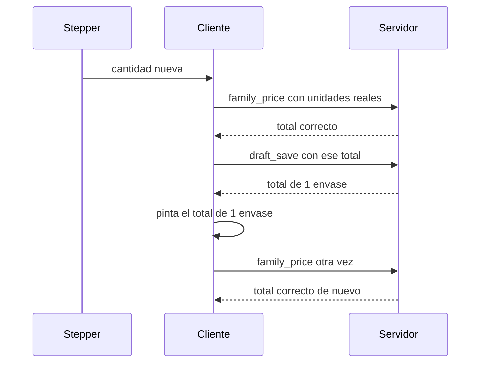

# Un solo cálculo de regla al cambiar cantidad

Cada cambio de cantidad en facturación debe pedir la regla una sola vez, y el guardado del borrador debe dejar ese precio. Hoy el precio se pinta tres veces: la regla correcta, la regla de 1 envase que devuelve el servidor, y otra vez la regla correcta.

Pantalla: `https://riverso.cl/interno/facturacion/`

## Productos de prueba

Los SKU 12900 y 222433 son la misma familia (grupo 7), regla R-1 «Regla estándar ferretería». La cantidad que vale para la regla es la suma de unidades: `cantidad × unidades del envase`.

| SKU | Qué es | Unidades por envase | producto_base_id |
| --- | --- | --- | --- |
| 12900 | embolsado, 1 unidad | 1 | 17219 |
| 222433 | envase | 100 | 3960 |

La regla se pide siempre con el producto unitario (12900, base 17219), aunque la fila editada sea el 222433.

Curva medida de `riverso_billing_family_price` (total de la familia, no de una fila):

| Unidades | Total | Unitario |
| --- | --- | --- |
| 1 | $50 | $50 |
| 100 (1 envase de 222433) | $1.300 | $13 |
| 200 | $2.600 | $13 |
| 300 | $3.000 | $10 |
| 301 (3 envases + 1 del 12900) | $3.050 | $10,1329 |

## Qué se vio en pantalla

Subir el 222433 a 3 envases (300 unidades):

1. El navegador pide la regla con `family_qty` 300 y muestra **$3.000** ($10 / ud).
2. El autoguardado manda `rule_total` 3000 y `unit_price` 10. La respuesta trae `rule_total` **1300** (la regla de 1 envase) y unitario **$433,33** (1300 / 3). Esa respuesta se pinta.
3. `hydrateAfterLoad` vuelve a pedir la regla y restaura **$3.000**.

Con los dos SKU juntos (3 envases del 222433 y 1 del 12900, 301 unidades) el cálculo correcto es **$3.050**. El guardado deja al 12900 casi igual y al 222433 le pone unitario **$1.013,29** (el precio por unidad × 100). La fila del envase queda en **$1.295,68** (los $1.300 de 1 envase prorrateados sobre 301 unidades). Después la regla se vuelve a pedir y el total vuelve a **$3.050**.

## Cadena en el código

Archivos de este repo:

- `php/riverso-pos/assets/js/billing-lines.js`
- `php/riverso-pos/assets/js/billing.js`
- `php/riverso-pos/sales/billing/class-billing-module.php`
- `php/riverso-pos/sales/billing/class-billing-draft-repository.php`
- `php/riverso-pos/sales/customer_quotes/class-quote-totals.php`

1. El stepper (`applyQty` ~367 y `commitQty` ~382 en `billing-lines.js`) llama a `recalcLocalLinePrice` o `recalcFamilyPrices` y, al terminar, a `scheduleDraftSave(0)`. Esa es la primera llamada a `riverso_billing_family_price`. La cantidad es la suma de `cantidad × units_per_pack` de la familia. Si esa suma no es mayor que 0, el cliente la fuerza a 1 (`familyQty = 1` ~2085 y ~1462): una cantidad 0 pide la regla de 1 unidad.

2. `saveDraft` en `billing.js` (~958) siempre hace `applyDraft` con la respuesta, también en el autoguardado silencioso.

3. `applyDraft` (~985) reemplaza las líneas con lo que devolvió el servidor y llama a `hydrateAfterLoad` (~2526 en `billing-lines.js`). Esa función redibuja y llama a `recalcAllFamilyGroups`: la tercera llamada a la regla, que corrige el precio.

4. En el servidor, `ajax_draft_save` (~1226 de `class-billing-module.php`) pasa por `prepare_draft_lines_for_save` (~704). Ahí `Riverso_Quote_Totals::calculate` arma el bruto de la línea y después se guarda `unit_price_bruto = line_net / quantity`. `quantity` es la cantidad de envases, no las unidades. `class-billing-draft-repository.php` (~128) persiste `unit_price_bruto` por delante de `unit_price`, y al leer (~288) ese valor vuelve como `unit_price`. El navegador pinta ese unitario hasta que el tercer disparo lo corrige.

El `blur` del campo de cantidad llama a `commitQty` y el clic de +/− llama a `applyQty`. Si el campo tiene el foco, un solo clic dispara las dos.

## Cambios

1. Un disparo por cambio de cantidad, en `billing-lines.js`. `applyQty` y `commitQty` siguen recalculando y, al terminar, guardan. No agregan otra llamada a la regla.

2. El autoguardado no vuelve a calcular ni pisa el precio, en `billing.js`. El `saveDraft` silencioso solo actualiza id y metadatos del borrador. No reemplaza `unit_price`, `_rule_total` ni `_rule_adjusted`, y no llama a `hydrateAfterLoad`. Esa función queda para abrir el documento, donde sí hace falta un cálculo inicial.

3. El servidor guarda el precio que recibió. `prepare_draft_lines_for_save` y `replace_lines` no deben convertir el total de la regla en un unitario dividiendo solo por la cantidad de envases, ni devolver la regla de 1 envase (`units_per_pack` sin multiplicar por la cantidad). Persistir `unit_price`, `units_per_pack`, `rule_total` y `rule_adjusted` como los mandó el cliente. Si se recalcula, usar la misma suma: cantidad × unidades del envase, sumando los SKU de la familia.

4. El botón +/− no dispara dos veces. El clic de +/− es el único que recalcula. El `blur` de ese mismo gesto no pide la regla.

## Comprobación

En un borrador, con 12900 y 222433:

- Subir el 222433 de 1 a 3 envases produce una sola llamada a `riverso_billing_family_price`, con `family_qty` 300 (o 301 si el 12900 sigue en 1). El total queda en el de esa cantidad y no pasa por el de 1 envase ($1.300).
- La respuesta de `riverso_billing_draft_save` trae el mismo `rule_total` y el mismo `unit_price` que se enviaron.
- Recargar el borrador muestra ese precio, sin un salto intermedio.
