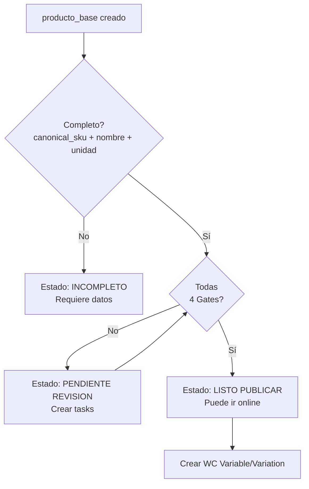
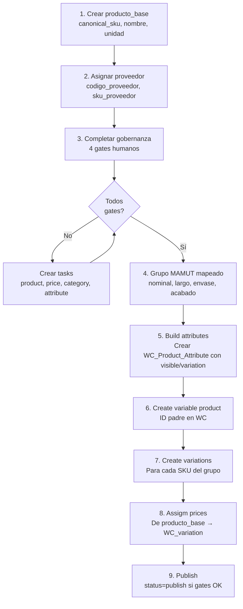
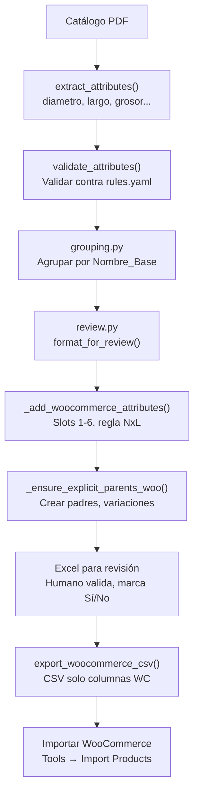
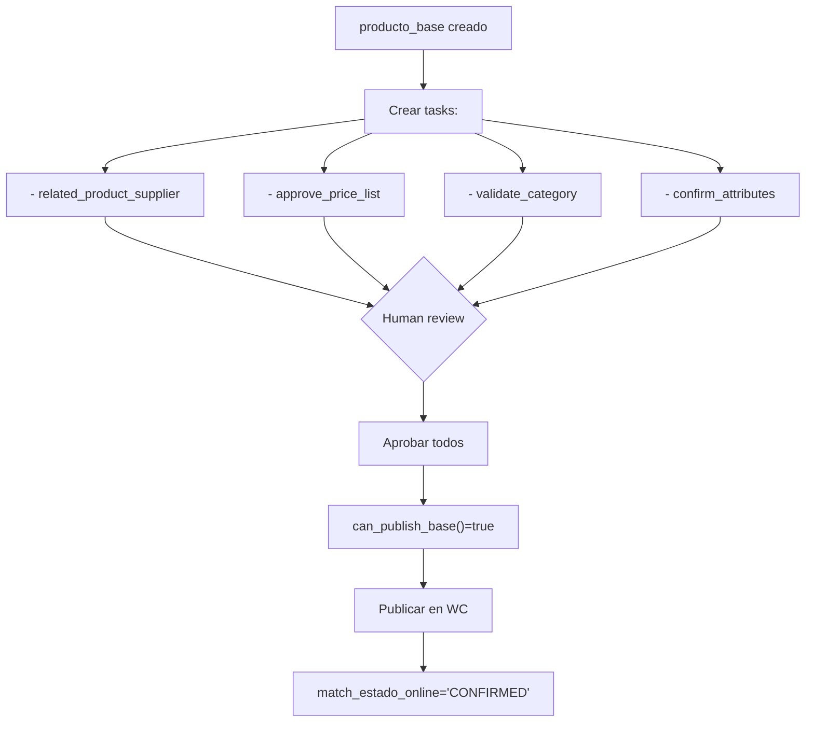
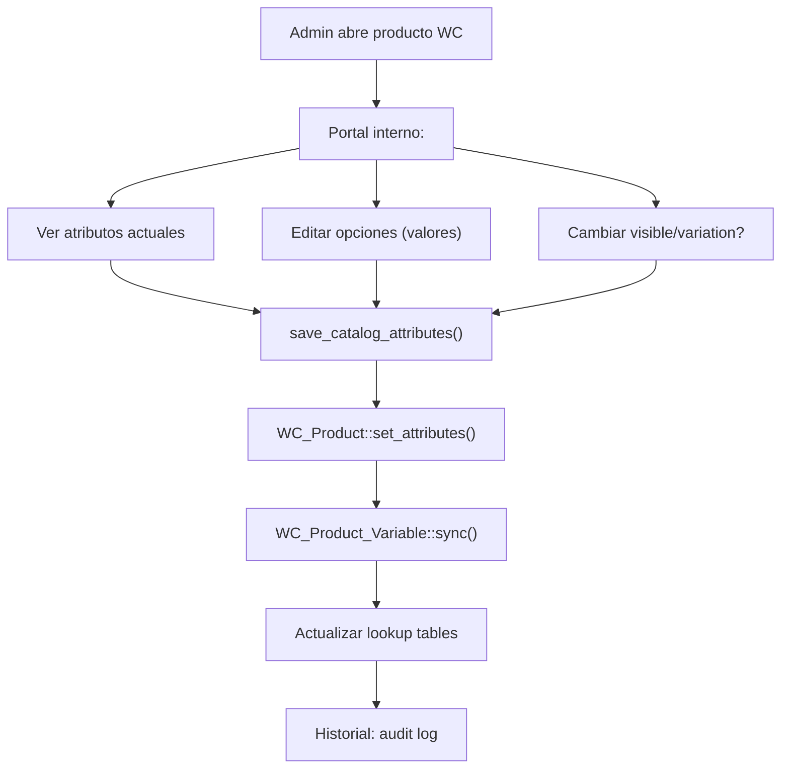

# Atributos Requeridos y Opcionales: Producto Local vs Producto Online

## Tabla de Contenidos
1. [Resumen Ejecutivo](#resumen-ejecutivo)
2. [Producto Local (producto_base)](#producto-local)
3. [Producto Online - Variable (Padre)](#producto-online-variable)
4. [Producto Online - Variante (Hijo)](#producto-online-variante)
5. [Catálogo Unificado de Atributos](#catálogo-unificado)
6. [Reglas de Precio](#reglas-de-precio)
7. [Árbol de Categorías](#árbol-de-categorías)
8. [Flujos y Dependencias](#flujos-y-dependencias)

---

## Resumen Ejecutivo

| Aspecto | Producto Local | Producto Online (Padre) | Producto Online (Variante) |
|---------|----------------|------------------------|---------------------------|
| **Tabla DB** | `riverso_producto_base` | `wp_posts` (tipo=product) | `wp_posts` (tipo=product_variation) |
| **Requeridos** | 3 campos | 3 campos | 4 campos |
| **Con Precio** | No | ❌ No | ✅ Sí |
| **Con Stock** | Sí (abierto/cerrado) | ❌ No | ✅ Sí |
| **Relación** | - | 1:1 mapeo a WC | 1:1 a producto_base |
| **Atributos** | 0 (meta con gobernanza) | Múltiples (WC_Product_Attribute) | Valores de padre |

---

## Producto Local

### Descripción
Entidad canónica interna que representa la unidad física mínima de inventario. Se crea en el POS, puede estar sin vinculación a WooCommerce o vinculada a variantes online.

**Tabla:** `riverso_producto_base`

### Atributos Requeridos

| Campo | Tipo | Descripción | Ejemplo | Validación |
|-------|------|-------------|---------|-----------|
| **canonical_sku** | VARCHAR(100) | SKU único interno | `TORNILLO-DW-6-18` | No nulo, único |
| **nombre_canonico** | VARCHAR(255) | Nombre normalizado | `Tornillo Drywall #6-18 x 1"` | No nulo, min 5 chars |
| **unidad_base** | VARCHAR(20) | Unidad mínima de venta | `unidad`, `caja`, `bolsa` | Enum validado |

### Atributos Opcionales Clave

| Campo | Tipo | Descripción | Notas |
|-------|------|-------------|-------|
| `woocommerce_product_id` | BIGINT | ID del padre en WC | Nulo si no publicado |
| `woocommerce_variation_id` | BIGINT | ID de la variante en WC | Nulo si local puro |
| `stock_abierto` | DECIMAL | Stock pendiente recepción | Inventario en tránsito |
| `codigo_abierto` | VARCHAR(50) | Código temporal | Asignado por recepción |
| `permite_decimal` | TINYINT | 1=se vende en fracciones | Ej: tela, cable |
| `permite_ean13` | TINYINT | 1=genera código de barras | Ej: productos pequeños |
| `nota_interna` | TEXT | Observaciones privadas | Solo visible en POS |

### Gobernanza (Campos de Control)

| Gate | Campo | Valores | Trigger |
|------|-------|--------|---------|
| **Revisión de producto** | `human_product_review` | pending\|approved\|rejected | Crear tarea `relacionar_producto_proveedor` |
| **Revisión de precio** | `human_price_review` | pending\|approved\|rejected | Crear tarea `aprobar_lista_precios` |
| **Revisión de categoría** | `human_category_review` | pending\|approved\|rejected | Crear tarea `validar_categoria` |
| **Revisión de atributos** | `human_attribute_review` | pending\|approved\|rejected | Crear tarea `confirmar_estructura_atributos` |

**Regla:** Todos los 4 gates deben estar en `approved` antes de publicar a WooCommerce.

### Relaciones

```
producto_base
├── Proveedores (riverso_producto_proveedor)
│   ├── codigo_proveedor
│   ├── sku_proveedor
│   └── precio_costo
├── Precios/Stock (productos) - canal especifico
├── Equivalencias (riverso_equivalence_members)
│   └── equivalence_group_id (familia)
├── Códigos de Barras (riverso_codigo_barra)
│   ├── tipo: EAN13, interno, proveedor
│   └── ean_interno (generado o manual)
└── WooCommerce
    ├── woocommerce_product_id (padre variable)
    └── woocommerce_variation_id (variante)
```

### Completitud y Estados



---

## Producto Online - Variable (Padre)

### Descripción
Producto padre de WooCommerce que agrupa variaciones. No tiene precio ni stock propios; solo define la estructura de atributos.

**Tabla:** `wp_posts` con `post_type='product'` y meta `_product_type='variable'`

### Atributos Requeridos

| Campo | WC API | Almacenamiento | Ejemplo | Notas |
|-------|--------|----------------|---------|-------|
| **name** | `set_name()` | `wp_posts.post_title` | "Tornillo Drywall #6 Variado" | No nulo, visible en tienda |
| **status** | `set_status()` | `wp_posts.post_status` | `draft` → `publish` | Private hasta gates aprobados |
| **attributes** | `set_attributes()` | `wp_postmeta._product_attributes` (JSON) | Ver catálogo unificado | Array de WC_Product_Attribute |

### Atributos Opcionales

| Campo | WC API | Descripción | Ejemplo |
|-------|--------|-------------|---------|
| `description` | `set_description()` | Descripción larga HTML | `<p>Tornillos para drywall...</p>` |
| `short_description` | `set_short_description()` | Extracto corto | "Tornillos de acero para tablaroca" |
| `category_ids` | `set_category_ids()` | IDs de categorías jerárquicas | `[12, 45]` |
| `tag_ids` | `set_tag_ids()` | Etiquetas planas | `["drywall", "tornillo"]` |
| `image_id` | `set_image_id()` | ID de attachment como thumbnail | `1234` |
| `gallery_image_ids` | `set_gallery_image_ids()` | IDs de imágenes galería | `"1234,1235,1236"` |
| `default_attributes` | post_meta | Variante mostrada por defecto | `{"nominal-x-largo": "#6 x 1"}` |
| `upsell_ids` | `set_upsell_ids()` | Productos recomendados | `[100, 101]` |
| `cross_sell_ids` | `set_cross_sell_ids()` | Complementos | `[200, 201]` |

### Atributos Locales de Variación

Los atributos definen cómo se agrupan las variaciones. Cada atributo tiene dos propiedades independientes:

```
┌─────────────────────────────┬──────────┬───────────┐
│      Atributo               │ Visible  │ Variation │
├─────────────────────────────┼──────────┼───────────┤
│ Nominal (Diámetro)          │ TRUE     │ FALSE     │ (Informativo)
│ Largo                       │ TRUE     │ FALSE     │ (Informativo)
│ Nominal X Largo             │ FALSE    │ TRUE      │ (Generador oculto)
│ Envase                      │ TRUE     │ TRUE      │ (Doble función)
│ Acabado                     │ TRUE     │ TRUE      │ (si múltiples)
│ Material                    │ TRUE     │ TRUE      │ (si múltiples)
│ Medida                      │ TRUE     │ TRUE      │ (si múltiples)
│ Tamaño                      │ TRUE     │ TRUE      │ (si múltiples)
│ Grosor                      │ TRUE     │ FALSE     │ (Informativo)
│ Entre Caras                 │ TRUE     │ FALSE     │ (Informativo)
│ Punta Torx                  │ TRUE     │ FALSE     │ (Informativo)
└─────────────────────────────┴──────────┴───────────┘
```

### Sin Precio ni Stock

⚠️ **CRÍTICO:**
- El padre NO tiene `_price`, `_regular_price`, `_sale_price`
- El padre NO tiene `_stock`, `_manage_stock`, `_stock_status`
- Estos se calculan automáticamente desde las variaciones con `WC_Product_Variable::sync($product_id)`

---

## Producto Online - Variante (Hijo)

### Descripción
Variación individual dentro de un producto variable. Mapea 1:1 a un `producto_base` local. Tiene precio y stock reales.

**Tabla:** `wp_posts` con `post_type='product_variation'`

### Atributos Requeridos

| Campo | WC API | Almacenamiento | Ejemplo | Validación |
|-------|--------|----------------|---------|-----------|
| **parent_id** | `set_parent_id()` | `wp_posts.post_parent` | `12345` (ID padre) | No nulo, debe existir |
| **sku** | `set_sku()` | `wp_postmeta._sku` | `TORNILLO-DW-6-18-001` | No nulo, único |
| **attributes** | `set_attributes()` | `wp_postmeta.attribute_{slug}` | `{"nominal-x-largo": "#6 x 1"}` | Array con valores de variación |
| **status** | `set_status()` | `wp_posts.post_status` | `publish` | Publica automáticamente |

**Nota:** El SKU de la variación coincide con el `canonical_sku` del `producto_base` vinculado.

### Atributos Opcionales

| Campo | WC API | Almacenamiento | Descripción |
|-------|--------|----------------|-------------|
| `regular_price` | `set_regular_price()` | `wp_postmeta._regular_price` | Precio sin oferta |
| `sale_price` | `set_sale_price()` | `wp_postmeta._sale_price` | Precio con descuento |
| `price` | `set_price()` | `wp_postmeta._price` | Precio activo (se calcula) |
| `manage_stock` | `set_manage_stock()` | `wp_postmeta._manage_stock` | `yes`/`no` |
| `stock_quantity` | `set_stock_quantity()` | `wp_postmeta._stock` | Cantidad disponible |
| `stock_status` | `set_stock_status()` | `wp_postmeta._stock_status` | `instock`, `outofstock`, `onbackorder` |
| `backorders` | `set_backorders()` | `wp_postmeta._backorders` | `no`, `notify`, `yes` |
| `weight` | `set_weight()` | `wp_postmeta._weight` | Peso en kg |
| `length` / `width` / `height` | `set_length/width/height()` | `wp_postmeta._length/_width/_height` | Dimensiones en cm |
| `description` | `set_description()` | `wp_posts.post_excerpt` | Descripción específica variante |
| `image_id` | `set_image_id()` | `wp_postmeta._thumbnail_id` | Imagen propia de variante |

---

## Catálogo Unificado de Atributos

### Fuentes
- **MAMUT PHP Publisher** (`class-woo-publisher-module.php`): Atributos extraídos del XML/JSON del catálogo MAMUT
- **Python Pipeline** (`src/attributes.py`, `src/review.py`): Atributos extraídos de PDF, validados y normalizados

### Atributos que Generan Variaciones

Estos atributos crean distintas SKUs/variantes dentro del producto variable.

| Atributo | visible | variation | Requerido | Rol | Ejemplo |
|----------|---------|-----------|-----------|-----|---------|
| **Nominal X Largo** | false | **true** | Sí* | Generador principal de variaciones | `#6-18 x 1"` |
| **Envase** | true | true | No | Múltiples envases = múltiples variantes | `Caja 1000`, `Bolsa 100` |
| **Acabado** | true | true | No | Múltiples acabados = múltiples variantes | `Galvanizado`, `Fosfatado` |
| **Material** | true | true | No | Múltiples materiales = múltiples variantes | `Acero`, `Inox`, `Cobre` |
| **Medida** | true | true | No | Alternativa a Nominal X Largo | `M6`, `1/4"` |
| **Tamaño** | true | true | No | Múltiples tamaños = múltiples variantes | `Grande`, `Mediano`, `Chico` |

*\*Requerido solo si hay nominal + largo en los datos MAMUT*

### Atributos Informativos (No Generan Variaciones)

Se muestran al cliente pero no definen variantes. El cliente **no puede elegir** estos atributos.

| Atributo | visible | variation | Requerido | Rol | Ejemplo |
|----------|---------|-----------|-----------|-----|---------|
| **Nominal** | true | false | Opcional | Diámetro/número mostrado | `#6-18`, `1/4"`, `40` |
| **Largo** | true | false | Opcional | Largo mostrado | `1"`, `60`, `1 1/4"` |
| **Grosor** | true | false | Opcional | Espesor mostrado | `2.5mm`, `3mm` |
| **Material** | true | false | No* | Material (cuando no genera variante) | `Acero galvanizado` |
| **Marca** | true | false | Opcional | Marca/fabricante | `MAMUT`, `WURTH` |
| **Entre Caras** | true | false | Opcional | Métrica de tuerca | `17mm`, `19mm` |
| **Punta Torx** | true | false | Opcional | Tipo de cabeza | `T25`, `T30` |
| **Código Tecfi** | false | false | Opcional | Código interno (oculto) | `ABC123` |

*Si hay un solo valor para todo el grupo, no es generador de variación*

### Regla MAMUT: Nominal X Largo

**Problema:** Si Nominal (N valores) y Largo (M valores) fueran generadores independientes, habría N×M variaciones cartesianas (ej: 5 nominales × 4 largos = 20 variaciones teóricas). En realidad, solo existen 8-10 combinaciones válidas en el catálogo.

**Solución:** Combinar nominal+largo en un atributo oculto de variación:

```
MAMUT Data:
├── Nominal: #6-18, #8-15, #10-12 (3 valores)
├── Largo: 1", 1.5", 2" (3 valores)
└── Producto tiene 8 SKUs:
    ├── TORNILLO-DW-001 → #6-18 x 1"
    ├── TORNILLO-DW-002 → #6-18 x 1.5"
    ├── TORNILLO-DW-003 → #8-15 x 1"
    ├── ... (solo combinaciones reales)
    └── TORNILLO-DW-008 → #10-12 x 2"

WooCommerce Atributos:
├── Nominal: [#6-18, #8-15, #10-12] (visible, no variacion)
├── Largo: [1", 1.5", 2"] (visible, no variacion)
└── Nominal X Largo: [#6-18 x 1", #6-18 x 1.5", ...] (OCULTO, variacion) ← GENERADOR REAL
```

**Implementación:**
- PHP `build_attributes()`: Detecta nominal+largo, crea atributo `Nominal X Largo` con `visible=false, variation=true`
- Python `review.py`: Implementa la misma lógica al exportar CSV

---

## Reglas de Precio

### Asignación Jerárquica

Una vez que `producto_base` está aprobado, se aplica la regla de precio según esta prioridad:

```
Resolver precio para: producto_base #123 con cantidad 100
├── 1. ¿Existe regla ASIGNADA DIRECTAMENTE?
│   └─ target_tipo='producto' AND target_id=123
│      Sí → Usar esa regla
│      No → Continuar
│
├── 2. ¿El producto pertenece a una FAMILIA (equivalence_group)?
│   └─ riverso_equivalence_members.producto_base_id=123
│      └─ Buscar: target_tipo='familia' AND target_id=<equivalence_group_id>
│         Sí → Usar esa regla (cantidad AGREGADA de familia)
│         No → Continuar
│
└── 3. FALLBACK: ¿WooCommerce categoria?
    └─ woocommerce_product_id → categoría WC
       └─ Buscar: target_tipo='categoria' AND target_id=<categoria_id>
          Sí → Usar esa regla
          No → Sin regla aplicada (precio base)
```

**Nota Crítica:** La agregación por familia (`calculate_family_qty_from_cart()`) **solo aplica en canal LOCAL (POS)**. El canal online NO agrega.

### Estructura de Regla

```
riverso_price_rules
├── codigo: "TORNILLO-LEGACY"
├── nombre: "Tornillos Legacy Std"
├── version: 1
├── estado: "aprobada"
└── tramos (riverso_price_rule_tiers):
    ├── qty_min: 1, qty_max: 50
    │  └─ formula: "precio * 1.25" (25% markup)
    │     redondeo: "50" (al 50 más cercano)
    │
    ├── qty_min: 51, qty_max: 100
    │  └─ formula: "precio * 1.15"
    │     redondeo: "50"
    │
    └── qty_min: 101, qty_max: NULL
       └─ formula: "precio * 1.05"
          redondeo: "10" (margen mínimo a partir de 101)
```

### Asignaciones

```
riverso_price_rule_assignments
├── rule_id: 1, target_tipo: 'producto', target_id: 123 (producto específico)
├── rule_id: 1, target_tipo: 'familia', target_id: 5 (equivalence_group)
└── rule_id: 2, target_tipo: 'categoria', target_id: 45 (WC category_id)
```

### Resolución en Código

```php
$resolver = new Price_Rule_Resolver();

// Canal LOCAL (POS) - Agregación por familia
$precio = $resolver->apply_for_base(
    producto_base_id: 123,
    qty: 150,
    canal: 'pos',
    familia_items: [123, 124, 125] // SKUs de la familia en carrito
);

// Canal ONLINE (WooCommerce) - Sin agregación
$precio = $resolver->apply_for_base(
    producto_base_id: 123,
    qty: 150,
    canal: 'online'
);
```

---

## Árbol de Categorías

### Estructura Jerárquica (WooCommerce)

```
product_cat (Taxonomía WordPress)
├── Ferretería (ID: 10)
│   ├── Tornillería (ID: 11)
│   │   ├── Tornillos Madera (ID: 12)
│   │   ├── Tornillos Drywall (ID: 13) ← Aquí va nuestro producto
│   │   └── Tornillos Máquina (ID: 14)
│   └── Clavos (ID: 15)
├── Plomería (ID: 20)
└── Electricidad (ID: 30)
```

### Asignación a Producto Online

- Se asigna al **producto variable (padre)**, no a cada variante
- Se gestiona con: `WC_Product::set_category_ids([array_de_ids])`
- Se almacena en: tabla `wp_term_relationships` + `wp_term_taxonomy`

### Creación Automática (PHP Publisher)

```php
$category_path = ['Ferretería', 'Tornillería', 'Tornillos Drywall'];
$result = $publisher->ensure_category_path(
    product_id: 12345,
    path: $category_path
);
// Crea la ruta si no existe, retorna array de IDs de categorías
```

### Requiere Aprobación Humana

Gate: `human_category_review` (en cada `producto_base` del grupo)

---

## Flujos y Dependencias

### Flujo 1: Creación de Producto Local → Online



### Flujo 2: Importación CSV Python → WooCommerce



### Flujo 3: Gatekeeping y Aprobación



### Flujo 4: Actualización de Atributos (Portal Interno)



---

## Tablas de Referencia Rápida

### Mapeo Campos: Local ↔ Online

| Local (producto_base) | Online Variable | Online Variation |
|----------------------|-----------------|------------------|
| `canonical_sku` | - | `wp_postmeta._sku` |
| `nombre_canonico` | `wp_posts.post_title` | - |
| `woocommerce_product_id` | `wp_posts.id` | `wp_posts.post_parent` |
| `woocommerce_variation_id` | - | `wp_posts.id` |
| - | `wp_postmeta._product_attributes` | `wp_postmeta.attribute_{slug}` |
| Precio desde reglas | ❌ (NULL) | `wp_postmeta._price` |
| `stock_abierto` | ❌ (NULL) | `wp_postmeta._stock` |

### Estados Relevantes

| Estado | Tabla | Campo | Significado |
|--------|-------|-------|-------------|
| `INCOMPLETO` | producto_base | - | Faltan datos requeridos |
| `PENDIENTE_REVISION` | producto_base | requires_human_review | Esperando gates |
| `LISTO_PUBLICAR` | producto_base | publication_stage | Todos los gates OK |
| `draft` / `publish` | wp_posts | post_status | Estado WooCommerce |
| `UNMATCHED` | producto_base | match_estado_online | Sin vinculación a WC |
| `AUTO_MATCH` | producto_base | match_estado_online | Matching automático encontró candidato |
| `CONFIRMED` | producto_base | match_estado_online | Humano confirmó vinculación |

---

## Resumen: Checklist de Implementación

### Para Producto Local Nuevo
- [ ] Ingresar `canonical_sku`, `nombre_canonico`, `unidad_base`
- [ ] Seleccionar proveedor y `codigo_proveedor`
- [ ] Asignar regla de precio (directa, familia, o categoria)
- [ ] Pasar 4 gates de revisión humana
- [ ] Confirmar gobernanza antes de publicar

### Para Producto Online (desde MAMUT)
- [ ] Extraer atributos: nominal, largo, grosor, material, acabado
- [ ] Aplicar regla NxL si nominal+largo
- [ ] Grouping: agrupar por `Nombre_Base`
- [ ] Build attributes: crear slots 1-6 con visible/variation dinámico
- [ ] Assign categories: arbol jerárquico
- [ ] Create parent + variations en WC
- [ ] Asignar precios y stock a variaciones
- [ ] Gates OK antes de `publish`

### Para Atributos
- [ ] Identificar generadores de variacion (N valores)
- [ ] Identificar informativos (1-N valores, no generan variación)
- [ ] Aplicar `visible` y `variation` según rol
- [ ] Usar slots 1-6, priorizar: Nominal, Largo, NxL, Envase, Acabado, Material
- [ ] Marca → campo custom `Marcas`, no atributo WC

---

## Contacto y Soporte

Para preguntas sobre:
- **Producto Local:** Ver [legacy_catalog_redesign.md](./architecture/legacy_catalog_redesign.md)
- **Atributos WooCommerce:** Ver [woo_product_structure.md](../woo_product_structure.md)
- **Python Pipeline:** Ver docstrings en `src/attributes.py`, `src/review.py`
- **PHP Publisher:** Ver `php/riverso-pos/modules/publish/class-woo-publisher-module.php`

---

*Documento generado: 2026-08-11 | Versión: 2.0 - Soporte para 6 slots de atributos y regla Nominal X Largo*
